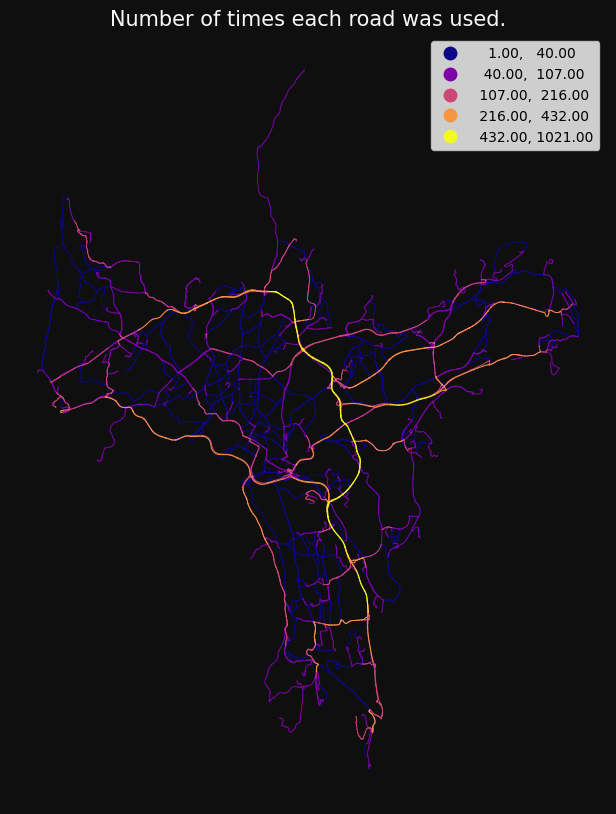
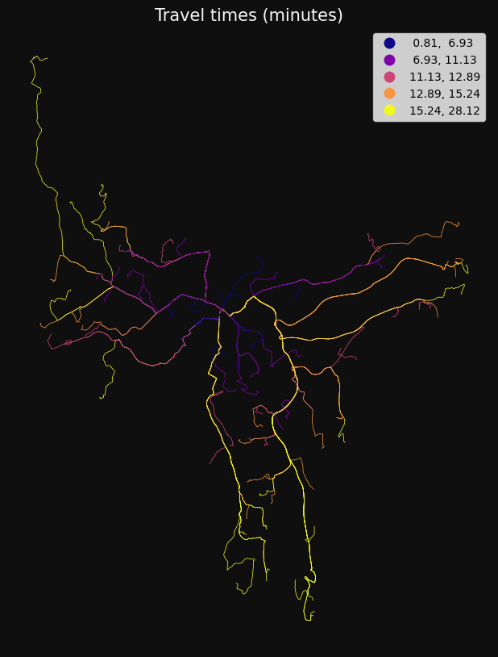
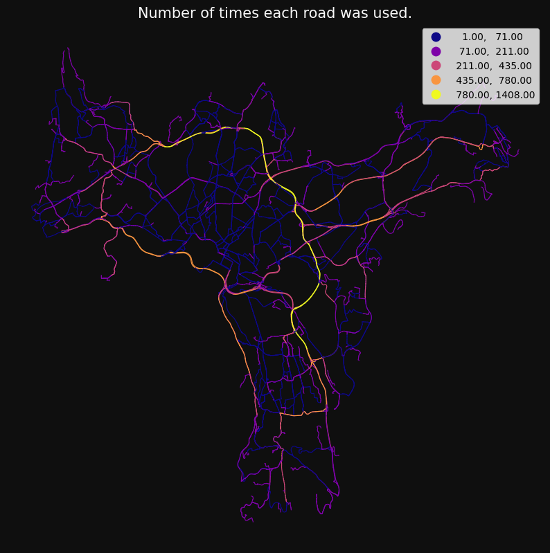
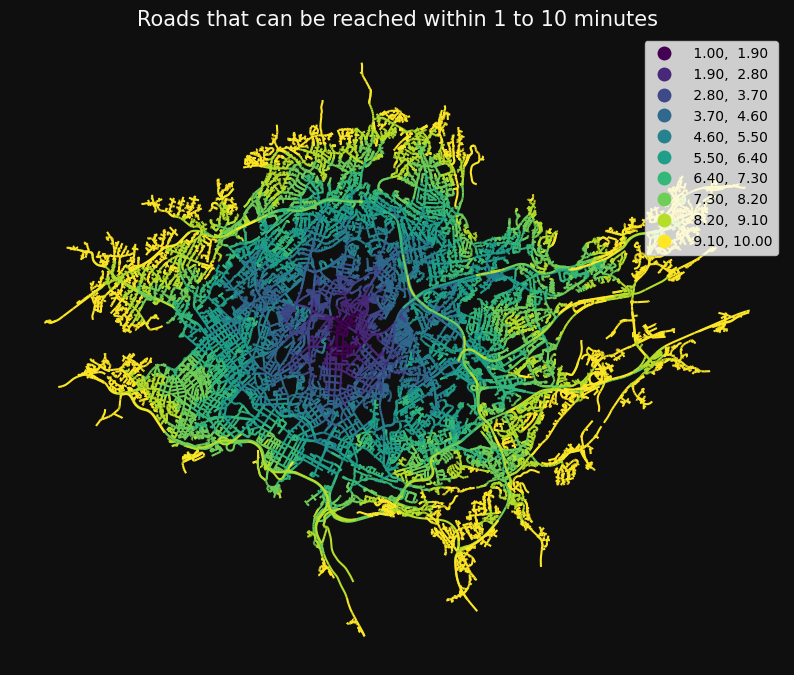

## Network analysis integrated with geopandas

The package offers methods that makes it easy to customise and optimise road data and
calculate travel times, routes, frequencies and service areas.

All you need is a GeoDataFrame of roads or other line geometries.

Here are some examples. More examples and info here: https://github.com/statisticsnorway/ssb-gis-utils/blob/main/network_analysis_demo_template.md

#### get_route_frequencies: get the number of times each line segment was visited

```python
freq = nwa.get_route_frequencies(points.sample(75), points.sample(75))

gs.qtm(
    gs.buff(freq, 15),
    "n",
    scheme="naturalbreaks",
    cmap="plasma",
    title="Number of times each road was used.",
)
```



#### od_cost_matrix: fast many-to-many travel times/distances

```python
od = nwa.od_cost_matrix(points.iloc[[0]], points, id_col="idx", lines=True)

print(od.head(3))

gs.qtm(od, "minutes", title="Travel time (minutes) from 1 to 1000 points.")
```

       origin  destination    minutes  \
    0       1            1   0.000000
    1       1            2  12.930588
    2       1            3  10.867076

                                                geometry
    0  LINESTRING (263122.700 6651184.900, 263122.700...
    1  LINESTRING (263122.700 6651184.900, 272456.100...
    2  LINESTRING (263122.700 6651184.900, 270082.300...



### get_route and get_k_routes: get one or more route per origin-destination pair

```python
routes = nwa.get_k_routes(points.iloc[[0]], points.iloc[[1]], k=5, drop_middle_percent=50)

gs.qtm(gs.buff(routes, 15), "k", title="k=5 low-cost routes", legend=False)
```



#### service_area: get the area that can be reached within one or more breaks

```python
sa = nwa.service_area(
    points.iloc[[0]],
    breaks=np.arange(1, 11),
)

gs.qtm(sa, "minutes", k=10, title="Roads that can be reached within 1 to 10 minutes")
```



## Developer information

### Git LFS

The data in the testdata directory is stored with [Git LFS](https://git-lfs.com/).
Make sure `git-lfs` is installed and that you have run the command `git lfs install`
at least once. You only need to run this once per user account.

### Dependencies

[Poetry](https://python-poetry.org/) is used for dependency management. Install
poetry and run the command below from the root directory to install the dependencies.

```shell
poetry install --no-root
```

### Tests

Use the following command from the root directory to run the tests:

```shell
poetry run pytest  # from root directory
```

#### Jupyter Notebooks

The files ending with `_ipynb.py` in the tests directory are jupyter notebooks
stored as plain python files, using `jupytext`. To open them as Jupyter notebooks,
right-click on them in JupyterLab and select Open With &rarr; Notebook.

When testing locally, start JupyterLab with this command:

```shell
poetry run jupter lab
```

For VS Code there are extensions for opening a python script as Jupyter Notebook,
for example:
[Jupytext for Notebooks](https://marketplace.visualstudio.com/items?itemName=donjayamanne.vscode-jupytext).

### Formatting

Format the code with `black` and `isort` by running the following command from the
root directory:

```shell
poetry run black .
poetry run isort .
```

### Pre-commit hooks

We are using [pre-commit hooks](https://pre-commit.com/) to make sure the code is
correctly formatted and consistent before committing. Use the following command from
the root directory in the repo to install the pre-commit hooks:

```shell
poetry run pre-commit install
```

It then checks the changed files before committing. You can run the pre-commit checks
on all files by using this command:

```shell
poetry run pre-commit run --all-files
```
