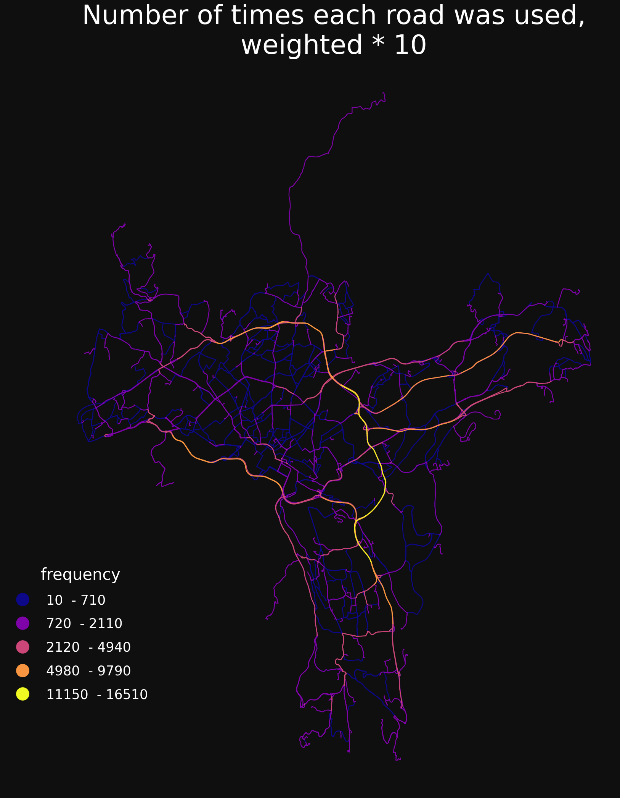
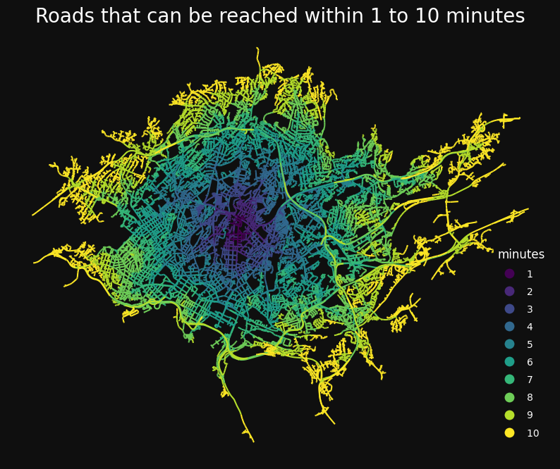
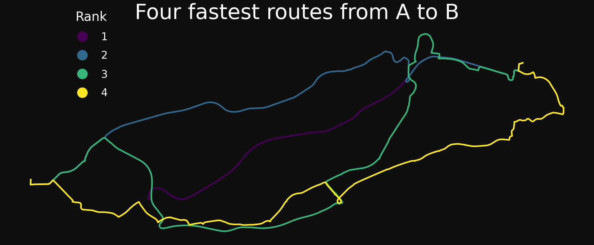

# ssb-sgis

GIS Python tools used in [Statistics Norway](https://www.ssb.no/en).

See documentation [here](https://statisticsnorway.github.io/ssb-sgis/reference/index.html).

[][pypi status]
[][pypi status]
[][pypi status]
[][license]

[][documentation]
[][tests]
[][sonarcov]
[][sonarquality]

[][pre-commit]
[][black]
[](https://github.com/astral-sh/ruff)
[][poetry]

[pypi status]: https://pypi.org/project/ssb-sgis/
[documentation]: https://statisticsnorway.github.io/ssb-sgis
[tests]: https://github.com/statisticsnorway/ssb-sgis/actions?workflow=Tests
[sonarcov]: https://sonarcloud.io/summary/overall?id=statisticsnorway_ssb-sgis
[sonarquality]: https://sonarcloud.io/summary/overall?id=statisticsnorway_ssb-sgis
[pre-commit]: https://github.com/pre-commit/pre-commit
[black]: https://github.com/psf/black
[poetry]: https://python-poetry.org/

sgis builds on the geopandas package and provides functions that make it easier to do GIS in python.
Features include network analysis, functions for exploring multiple GeoDataFrames in a layered interactive map,
and vector operations like finding k-nearest neighbours, splitting lines by points, snapping and closing holes
in polygons by size.

To install, use one of:

```shell
poetry add ssb-sgis
pip install ssb-sgis
```

The sgis package has the following optional dependencies:

- bucket: For working with files stored in GCP buckets
- torch: Use functionality from PyTorch and torchgeo
- xarray: Use functionality from xarray and rioxarray
- test: Packages needed for running pytest
- all: All optional dependencies

The optional dependencies can be installed by adding them in
brackets when installing, like this:

```shell
poetry add ssb-sgis[all]
pip install ssb-sgis[all]
```

## Network analysis examples

Preparing for network analysis:

```python
import sgis as sg


roads = sg.read_parquet_url(
    "https://media.githubusercontent.com/media/statisticsnorway/ssb-sgis/main/tests/testdata/roads_oslo_2022.parquet"
)

connected_roads = sg.get_connected_components(roads).loc[lambda x: x["connected"] == 1]

directed_roads = sg.make_directed_network_norway(
    connected_roads,
    dropnegative=True,
)

rules = sg.NetworkAnalysisRules(directed=True, weight="minutes")

nwa = sg.NetworkAnalysis(network=directed_roads, rules=rules)

nwa
```

    NetworkAnalysis(
        network=Network(6364 km, percent_bidirectional=87),
        rules=NetworkAnalysisRules(weight=minutes, directed=True, search_tolerance=250, search_factor=0, split_lines=False, ...),
        log=True, detailed_log=False,
    )

Fast many-to-many travel times/distances.

```python
points = sg.read_parquet_url("https://media.githubusercontent.com/media/statisticsnorway/ssb-sgis/main/tests/testdata/points_oslo.parquet")
od = nwa.od_cost_matrix(points, points)

print(od)
```

            origin  destination    minutes
    0            0            0   0.000000
    1            0            1  13.039830
    2            0            2  10.902453
    3            0            3   8.297021
    4            0            4  14.742294
    ...        ...          ...        ...
    999995     999          995  11.038673
    999996     999          996  17.820664
    999997     999          997  10.288465
    999998     999          998  14.798257
    999999     999          999   0.000000

    [1000000 rows x 3 columns]

Get number of times each line segment was visited, with optional weighting.

```python
origins = points.iloc[:100]
destinations = points.iloc[100:200]

# creating uniform weights of 10
od_pairs = pd.MultiIndex.from_product([origins.index, destinations.index])
weights = pd.DataFrame(index=od_pairs)
weights["weight"] = 10

frequencies = nwa.get_route_frequencies(origins, destinations, weight_df=weights)

# plot the results
m = sg.ThematicMap(sg.buff(frequencies, 15), column="frequency", black=True)
m.cmap = "plasma"
m.title = "Number of times each road was used,\nweighted * 10"
m.plot()
```



Get the area that can be reached within one or more breaks.

```python
service_areas = nwa.service_area(
    points.iloc[[0]],
    breaks=np.arange(1, 11),
)

# plot the results
m = sg.ThematicMap(service_areas, column="minutes", black=True, size=10)
m.k = 10
m.title = "Roads that can be reached within 1 to 10 minutes"
m.plot()
```



Get one or more route per origin-destination pair.

```python
routes = nwa.get_k_routes(
    points.iloc[[0]], points.iloc[[1]], k=4, drop_middle_percent=50
)

m = sg.ThematicMap(sg.buff(routes, 15), column="k", black=True)
m.title = "Four fastest routes from A to B"
m.legend.title = "Rank"
m.plot()
```



More network analysis examples can be found here: https://github.com/statisticsnorway/ssb-sgis/blob/main/docs/network_analysis_demo_template.md

Road data for Norway can be downloaded here: https://kartkatalog.geonorge.no/metadata/nvdb-ruteplan-nettverksdatasett/8d0f9066-34f9-4423-be12-8e8523089313

## Developer information

### Git LFS

The data in the testdata directory is stored with [Git LFS](https://git-lfs.com/).
Make sure `git-lfs` is installed and that you have run the command `git lfs install`
at least once. You only need to run this once per user account.

### Dependencies

[Poetry](https://python-poetry.org/) is used for dependency management. Install
poetry and run the command below from the root directory to install the dependencies.

```shell
poetry install -E test --no-root
```

### Tests

Use the following command from the root directory to run the tests:

```shell
poetry run pytest  # from root directory
```

#### Jupyter Notebooks

The files ending with `_ipynb.py` in the tests directory are jupyter notebooks
stored as plain python files, using `jupytext`. To open them as Jupyter notebooks,
right-click on them in JupyterLab and select Open With &rarr; Notebook.

When testing locally, start JupyterLab with this command:

```shell
poetry run jupter lab
```

For VS Code there are extensions for opening a python script as Jupyter Notebook,
for example:
[Jupytext for Notebooks](https://marketplace.visualstudio.com/items?itemName=donjayamanne.vscode-jupytext).

### Code quality

Run 'ruff' on all files with safe fixes:

```shell
poetry run ruff check --fix .
```

### Formatting

Format the code with `black` and `isort` by running the following command from the
root directory:

```shell
poetry run black .
poetry run isort .
```

### Pre-commit hooks

We are using [pre-commit hooks](https://pre-commit.com/) to make sure the code is
correctly formatted and consistent before committing. Use the following command from
the root directory in the repo to install the pre-commit hooks:

```shell
poetry run pre-commit install
```

It then checks the changed files before committing. You can run the pre-commit checks
on all files by using this command:

```shell
poetry run pre-commit run --all-files
```

### Documentation

To generate the API-documentation locally, run the following command from the root
directory:

```shell
poetry run sphinx-build -W docs docs/_build
```

Then open the file `docs/_build/index.html`.

To check and run the docstrings examples, run this command:

```shell
poetry run xdoctest --command=all ./src/sgis
```

## Contributing

Contributions are very welcome.
To learn more, see the [Contributor Guide].

## License

Distributed under the terms of the [MIT license][license],
_SSB sgis_ is free and open source software.

## Issues

If you encounter any problems,
please [file an issue] along with a detailed description.

## Credits

This project was generated from [Statistics Norway]'s [SSB PyPI Template].

[statistics norway]: https://www.ssb.no/en
[pypi]: https://pypi.org/
[ssb pypi template]: https://github.com/statisticsnorway/ssb-pypitemplate
[file an issue]: https://github.com/statisticsnorway/ssb-sgis/issues
[pip]: https://pip.pypa.io/

<!-- github-only -->

[license]: https://github.com/statisticsnorway/ssb-sgis/blob/main/LICENSE
[contributor guide]: https://github.com/statisticsnorway/ssb-sgis/blob/main/CONTRIBUTING.md
[reference guide]: https://statisticsnorway.github.io/ssb-sgis/reference.html
