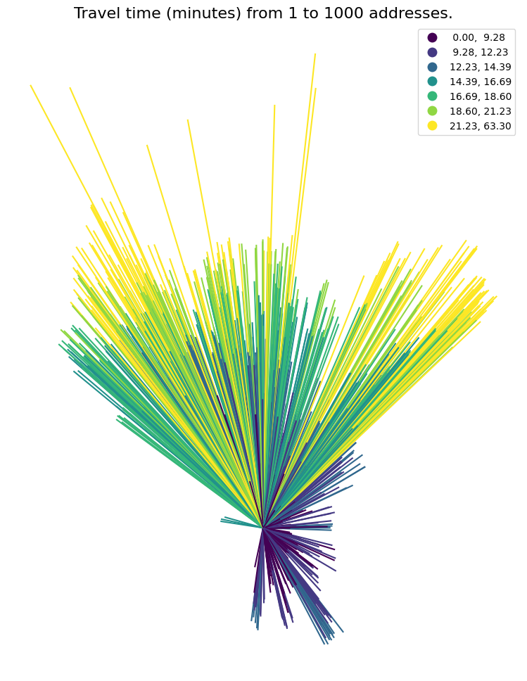

# Network analysis with gis_utils

Network analysis with igraph, integrated with geopandas.

The package supports three types of network analysis:

- od_cost_matrix: fast many-to-many travel times/distances
- shortest_path: returns the geometry of the lowest-cost paths,
  or counts the number of times each road segment was used.
- service_area: returns the roads that can be reached within one or more impedances.

```python

import warnings
import geopandas as gpd
import matplotlib.pyplot as plt
import numpy as np
import pandas as pd

import gis_utils as gs

# ignoring some warnings:
pd.options.mode.chained_assignment = None  # ignore SettingWithCopyWarning for now
warnings.filterwarnings(action="ignore", category=UserWarning)
warnings.filterwarnings(action="ignore", category=FutureWarning)

```

Before network analysis can start, we need three things:

- a network
- some network analysis rules
- points from which the distance calculations will start and end

Let's start by loading the data.

```

points = gpd.read_parquet("tests/testdata/random_points.parquet")

```

| idx |                                    geometry |
| --: | ------------------------------------------: |
|   1 |                  POINT (263122.7 6651184.9) |
|   2 |                  POINT (272456.1 6653369.5) |
|   3 | POINT (270082.2999999999 6653032.699999999) |
|   4 |         POINT (259804.8000000001 6650339.7) |
|   5 | POINT (272876.2000000001 6652889.099999999) |

```

roads = gpd.read_parquet("tests/testdata/roads_oslo_2022.parquet")
roads = roads[["oneway", "drivetime_fw", "drivetime_bw", "geometry"]]
roads.head(3)

```

# The Network

The road data can be made into a network like this

```

nw = gs.Network(roads)
nw

```



```


```
