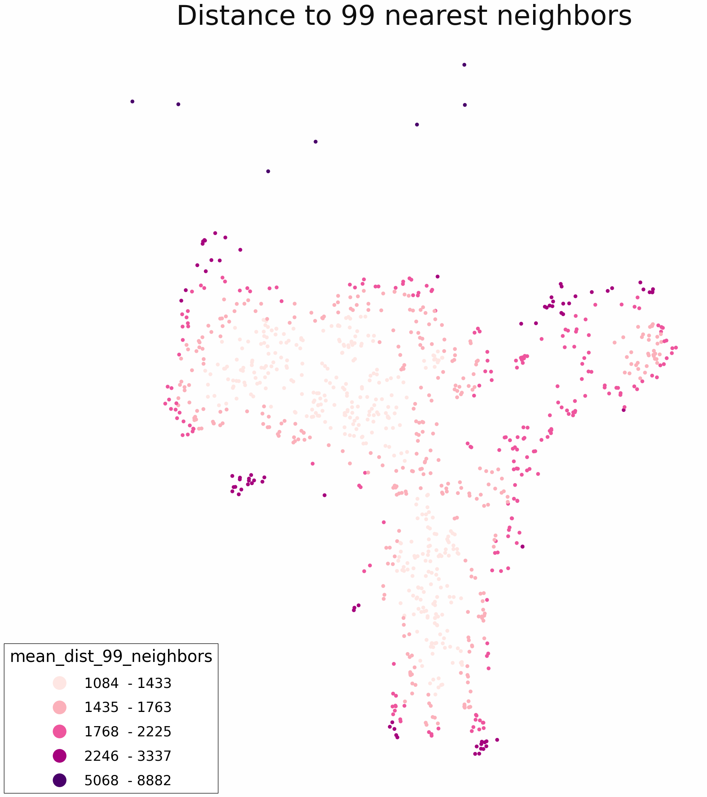
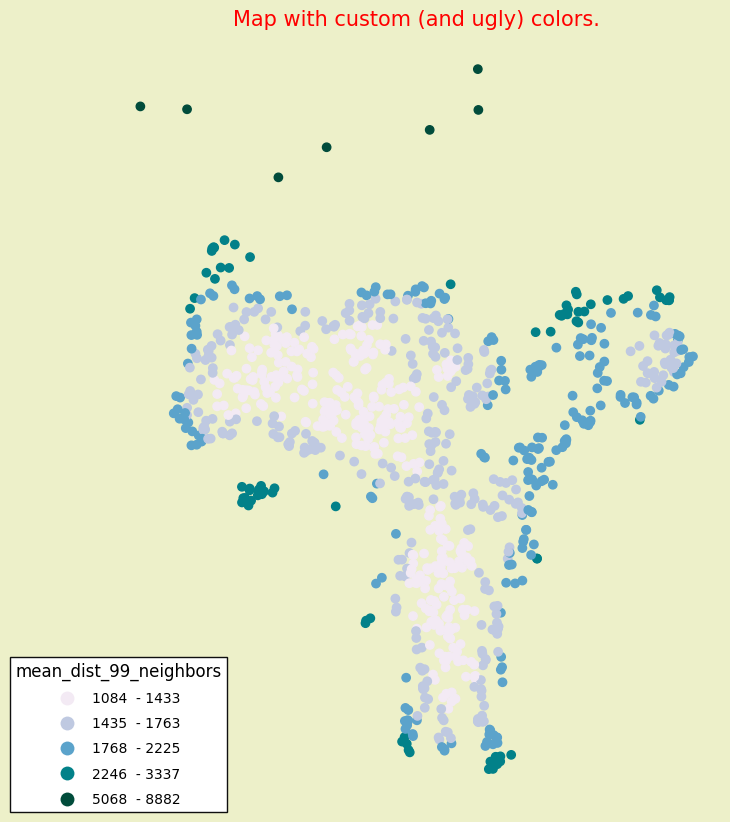
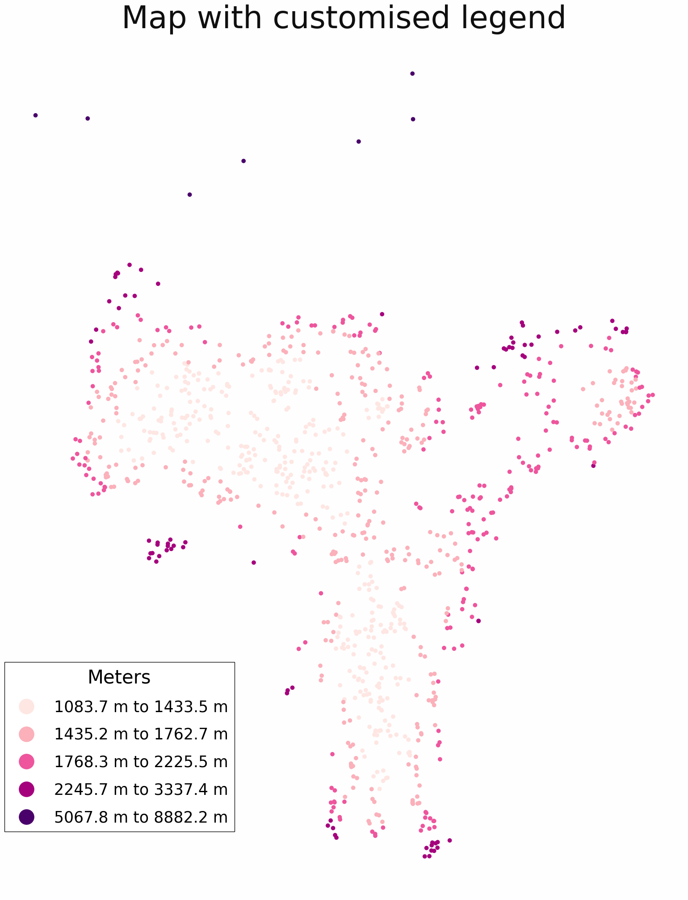
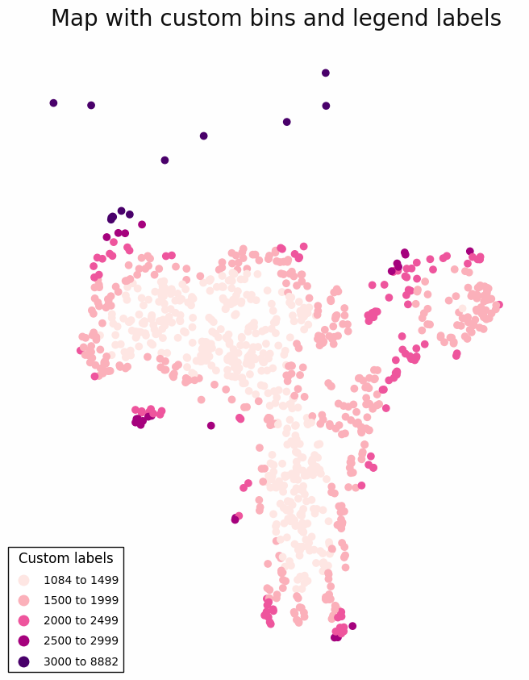
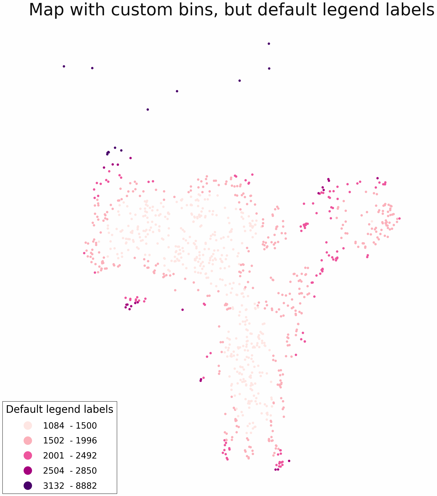
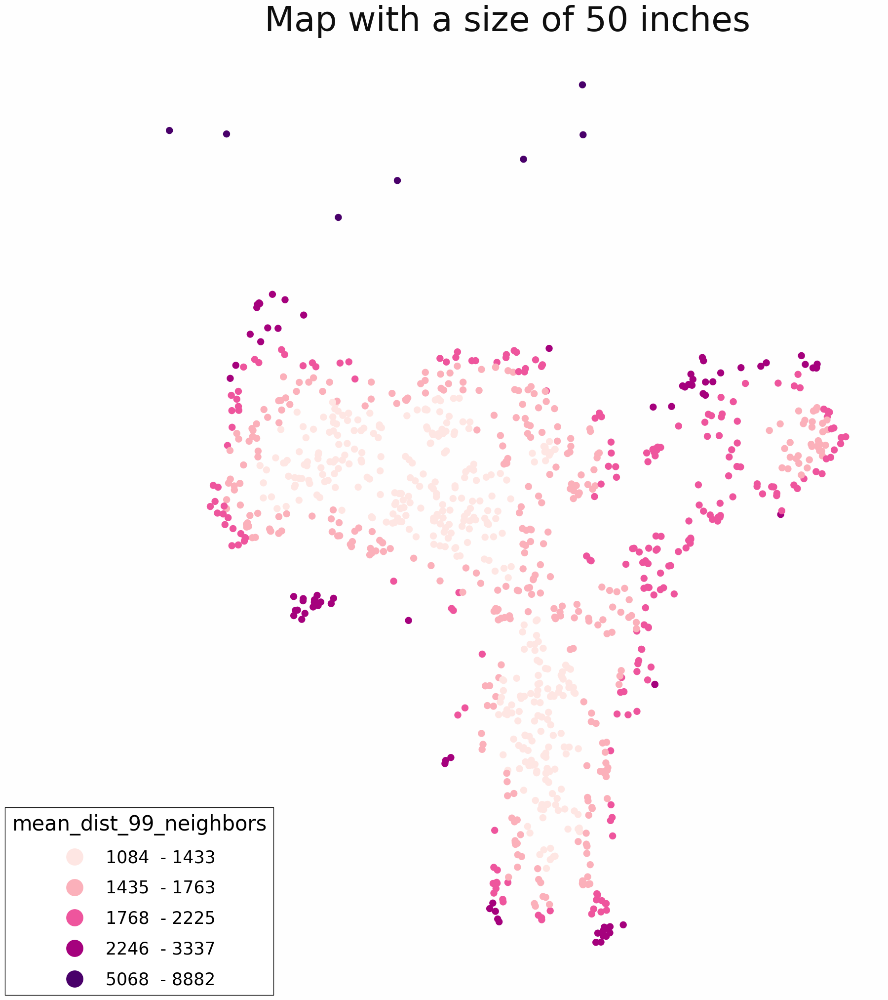
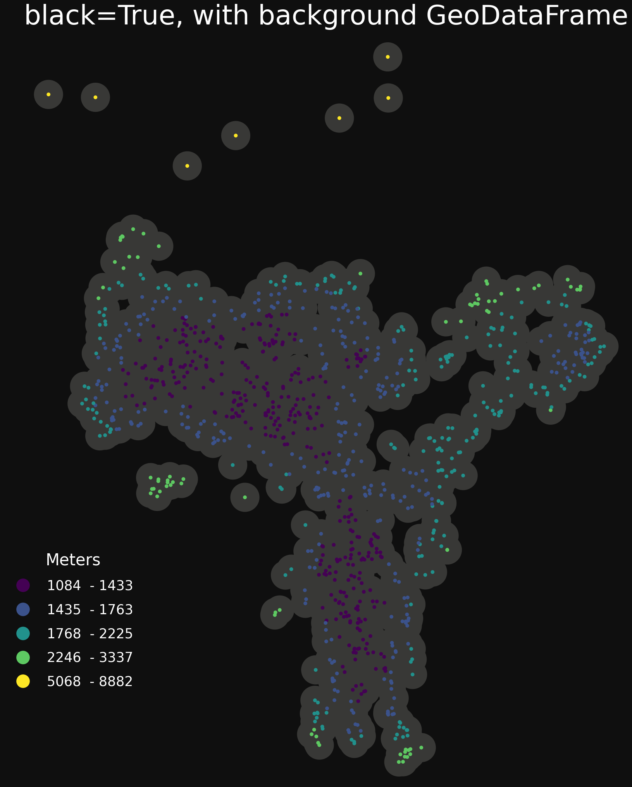
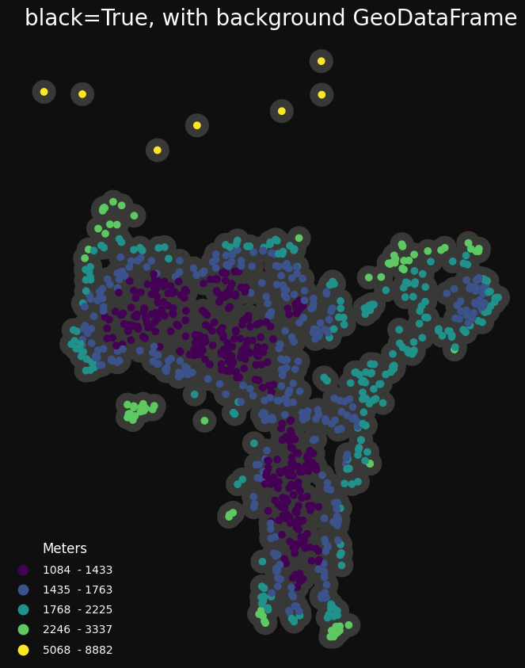

# Maps

```python
import sgis as sg
```

First get 1000 addresses in Oslo and create a distance to neighbors column.

```python
points = sg.read_parquet_url(
    "https://media.githubusercontent.com/media/statisticsnorway/ssb-sgis/main/tests/testdata/points_oslo.parquet"
)
points = points[["geometry"]]

distances = sg.get_k_nearest_neighbors(points, points, k=100)

mean_distance_above_0 = (
    distances.loc[distances.distance != 0].groupby(level=0)["distance"].mean()
)

points["mean_dist_99_neighbors"] = mean_distance_above_0

print(points)
```

                               geometry  mean_dist_99_neighbors
    0    POINT (263122.700 6651184.900)             1204.553751
    1    POINT (272456.100 6653369.500)             1533.461927
    2    POINT (270082.300 6653032.700)             1936.809121
    3    POINT (259804.800 6650339.700)             1543.413872
    4    POINT (272876.200 6652889.100)             1591.876630
    ..                              ...                     ...
    995  POINT (266801.700 6647844.500)             1608.700153
    996  POINT (261274.000 6653593.400)             1400.188082
    997  POINT (263542.900 6645427.000)             1563.372903
    998  POINT (269226.700 6650628.000)             2103.451510
    999  POINT (264570.300 6644239.500)             1198.421330

    [1000 rows x 2 columns]

Create and save a simple plot with legend and title.

```python
m = sg.ThematicMap(
    sg.buff(points, 100),
    column="mean_dist_99_neighbors",
    title="Distance to 99 nearest neighbors",
)
m.plot()
m.save("path_to_file.png")
```



Customising the colors and text. Creating an ugly example.

```python
m = sg.ThematicMap(
    sg.buff(points, 100),
    column="mean_dist_99_neighbors",
    title="Map with custom (and ugly) colors.",
    title_fontsize=15,
    title_color="red",
    facecolor="#edf0c9",  # background color
    cmap="PuBuGn",
    cmap_start=20,
)
m.plot()
```



See here for available cmaps: https://matplotlib.org/stable/tutorials/colors/colormaps.html

Customising the legend can be done through the legend attribute.

```python
m = sg.ThematicMap(
    sg.buff(points, 100),
    column="mean_dist_99_neighbors",
    title="Map with customised legend",
    legend_kwargs=dict(
        title="Meters",
        label_sep="to",
        label_suffix="m",
        position=(0.35, 0.28),
        rounding=1,
    ),
)
m.plot()
```



Using custom breaks and labels for the color classification.

```python
m = sg.ThematicMap(
    sg.buff(points, 100),
    column="mean_dist_99_neighbors",
    title="Map with custom bins",
    bins=[1500, 2000, 2500, 3000],
)
min_value = points["mean_dist_99_neighbors"].min()
max_value = points["mean_dist_99_neighbors"].max()
m.legend.labels = [
    f"{int(round(min_value))} to 1499",
    "1500 to 1999",
    "2000 to 2499",
    "2500 to 2999",
    f"3000 to {int(round(max_value))}",
]
m.plot()
```



Setting manual bins, but not labels, gives a legend which uses the minimum and
maximum values in each color group. This will be accurate and truthful, but
somewhat confusing.

```python
m = sg.ThematicMap(
    sg.buff(points, 100),
    column="mean_dist_99_neighbors",
    title = "Map with custom bins, but default legend labels",
    bins = [1500, 2000, 2500, 3000],
    legend_kwargs={
        "title": "Default legend labels",
    },
)
m.plot()
```



GeoDataFrames can be added as background with the add_background method.
The background gdf will be gray by default, but can be changed by setting
the color.

```python
m = sg.ThematicMap(
    sg.buff(points, 100),
    column="mean_dist_99_neighbors",
    title = "Map with a background GeoDataFrame",
    legend_kwargs={
        "title": "Meters",
    },
)
background = sg.buff(points, 500)
m.add_background(background, color=None)
m.plot()
```



Setting black to True gives opposite colors and a palette suited for a black
background (viridis).

```python
m = sg.ThematicMap(
    points,
    column="mean_dist_99_neighbors",
    black=True,
    title = "black=True, with background GeoDataFrame",
    legend_kwargs={
        "title": "Meters",
    },
)
background = sg.buff(points, 500)
m.add_background(background)
m.plot()
```



Customising all at once.

```python
min_value = points["mean_dist_99_neighbors"].min()
max_value = points["mean_dist_99_neighbors"].max()

m = sg.ThematicMap(
    sg.buff(points, 100),
    column="mean_dist_99_neighbors",
    title="Everything customised",
    bins=[1500, 2000, 2500, 3000],
    facecolor="#fcfcfc",  # =almost white
    cmap="YlGnBu",
    cmap_start=50,
    title_fontsize=125,
    title_color="#141414",  # =almost black
    legend_kwargs=dict(
        title="Meters",
        title_fontsize=55,
        fontsize=45,
        markersize=30,
        position=(0.35, 0.28),
        labels=[
            f"{int(round(min_value))} to 1499",
            "1500 to 1999",
            "2000 to 2499",
            "2500 to 2999",
            f"3000 to {int(round(max_value))}",
        ],
    ),
)

background = sg.buff(points, 500)
m.add_background(background, color="#f0f0f0")

m.plot()
m.save("path_to_file.png")
```


