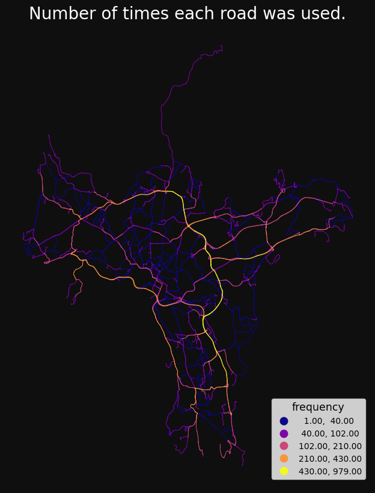
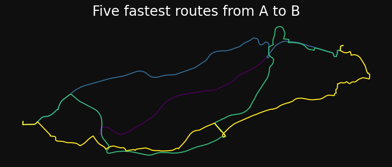

```python

import os
import warnings

import numpy as np
import pandas as pd


os.chdir("../../src")
import sgis as sg


# ignore some warnings to make it cleaner
pd.options.mode.chained_assignment = None
warnings.filterwarnings(action="ignore", category=UserWarning)
warnings.filterwarnings(action="ignore", category=FutureWarning)
import geopandas as gpd


"""
r = gpd.read_file(
    r"C:/Users\\ort\\Downloads\vegnettRuteplan_FGDB_20230109.gdb",
    layer="ruttger_link_geom",
    engine="pyogrio",
    where="municipality in ('3416')",
)
r.to_parquet("C:/Users/ort/git/ssb-sgis/tests/testdata/roads_eidskog_2022.parquet")

r2 = (
    r.sample(40)
    .assign(geometry=lambda x: x.centroid.buffer(np.arange(1, 41)))
    .pipe(sg.to_multipoint)
    .explode()
    .sample(100)
    .reset_index()
    .assign(idx=range(100))[["idx", "geometry"]]
)

r2.to_parquet("C:/Users/ort/git/ssb-sgis/tests/testdata/points_eidskog.parquet")
r2.explore()
"""
```

    '\nr = gpd.read_file(\n    r"C:/Users\\ort\\Downloads\x0begnettRuteplan_FGDB_20230109.gdb",\n    layer="ruttger_link_geom",\n    engine="pyogrio",\n    where="municipality in (\'3416\')",\n)\nr.to_parquet("C:/Users/ort/git/ssb-sgis/tests/testdata/roads_eidskog_2022.parquet")\n\nr2 = (\n    r.sample(40)\n    .assign(geometry=lambda x: x.centroid.buffer(np.arange(1, 41)))\n    .pipe(sg.to_multipoint)\n    .explode()\n    .sample(100)\n    .reset_index()\n    .assign(idx=range(100))[["idx", "geometry"]]\n)\n\nr2.to_parquet("C:/Users/ort/git/ssb-sgis/tests/testdata/points_eidskog.parquet")\nr2.explore()\n'

```python

"""
roads = sg.read_parquet_url(
    "https://media.githubusercontent.com/media/statisticsnorway/ssb-sgis/main/tests/testdata/roads_oslo_2022.parquet"
)

nw = (
    sg.DirectedNetwork(roads)
    .remove_isolated()
    .make_directed_network(
        direction_col="oneway",
        direction_vals_bft=("B", "FT", "TF"),
        minute_cols=("drivetime_fw", "drivetime_bw"),
    )
)

rules = sg.NetworkAnalysisRules(weight="minutes")

nwa = sg.NetworkAnalysis(network=nw, rules=rules)

nwa
"""
```

    '\nroads = sg.read_parquet_url(\n    "https://media.githubusercontent.com/media/statisticsnorway/ssb-sgis/main/tests/testdata/roads_oslo_2022.parquet"\n)\n\nnw = (\n    sg.DirectedNetwork(roads)\n    .remove_isolated()\n    .make_directed_network(\n        direction_col="oneway",\n        direction_vals_bft=("B", "FT", "TF"),\n        minute_cols=("drivetime_fw", "drivetime_bw"),\n    )\n)\n\nrules = sg.NetworkAnalysisRules(weight="minutes")\n\nnwa = sg.NetworkAnalysis(network=nw, rules=rules)\n\nnwa\n'

```python

points = sg.read_parquet_url(
    "https://media.githubusercontent.com/media/statisticsnorway/ssb-sgis/main/tests/testdata/points_oslo.parquet"
)

### !!!
### COPY EVERYTHING BELOW INTO readme.md and change the png paths.
### !!!
```

sgis builds on the geopandas package and provides functions that make it easier to do advanced GIS in python.
Features include network analysis, functions for exploring multiple GeoDataFrames in a layered interactive map,
and vector operations like finding k-nearest neighbours, splitting lines by points, snapping and closing holes
in polygons by size.

### Network analysis examples

Preparing for network analysis:

```python
import sgis as sg


roads = sg.read_parquet_url(
    "https://media.githubusercontent.com/media/statisticsnorway/ssb-sgis/main/tests/testdata/roads_oslo_2022.parquet"
)

nw = (
    sg.DirectedNetwork(roads)
    .remove_isolated()
    .make_directed_network(
        direction_col="oneway",
        direction_vals_bft=("B", "FT", "TF"),
        minute_cols=("drivetime_fw", "drivetime_bw"),
    )
)

rules = sg.NetworkAnalysisRules(weight="minutes")

nwa = sg.NetworkAnalysis(network=nw, rules=rules)

nwa
```

    NetworkAnalysis(
        network=DirectedNetwork(6364 km, percent_bidirectional=87),
        rules=NetworkAnalysisRules(weight=minutes, search_tolerance=250, search_factor=0, split_lines=False, ...),
        log=True, detailed_log=True,
    )

Get number of times each line segment was visited

```python
freq = nwa.get_route_frequencies(points.sample(75), points.sample(75))

sg.qtm(
    sg.buff(freq, 15),
    "frequency",
    scheme="naturalbreaks",
    cmap="plasma",
    title="Number of times each road was used.",
)
```



    (<Figure size 1000x1000 with 1 Axes>,
     <Axes: title={'center': 'Number of times each road was used.'}>)

Fast many-to-many travel times/distances

```python
od = nwa.od_cost_matrix(points, points)

print(od)
```

            origin  destination    minutes
    0            0            0   0.000000
    1            0            1  13.039830
    2            0            2  10.902453
    3            0            3   8.297021
    4            0            4  14.742294
    ...        ...          ...        ...
    999995     999          995  11.038673
    999996     999          996  17.820664
    999997     999          997  10.288465
    999998     999          998  14.798257
    999999     999          999   0.000000

    [1000000 rows x 3 columns]

Get the area that can be reached within one or more breaks

```python
sa = nwa.service_area(
    points.iloc[[0]],
    breaks=np.arange(1, 11),
)

sg.qtm(sa, "minutes", k=10, title="Roads that can be reached within 1 to 10 minutes")
```


    (<Figure size 1000x1000 with 1 Axes>,
     <Axes: title={'center': 'Roads that can be reached within 1 to 10 minutes'}>)

Get one or more route per origin-destination pair

```python
routes = nwa.get_k_routes(
    points.iloc[[0]], points.iloc[[1]], k=5, drop_middle_percent=50
)

sg.qtm(sg.buff(routes, 15), "k", title="Five fastest routes from A to B", legend=False)
```

    (<Figure size 1000x1000 with 1 Axes>,
     <Axes: title={'center': 'Five fastest routes from A to B'}>)



More network analysis examples can be found here: https://github.com/statisticsnorway/ssb-sgis/blob/main/docs/network_analysis_demo_template.md

# Road data for Norway can be downloaded here: https://kartkatalog.geonorge.no/metadata/nvdb-ruteplan-nettverksdatasett/8d0f9066-34f9-4423-be12-8e8523089313
