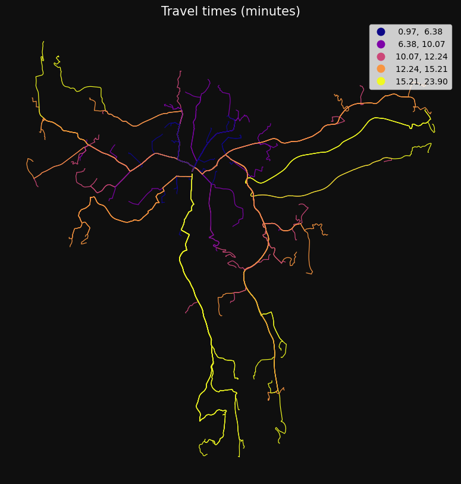

```python
# %%--
# jupyter:
#   jupytext:
#     text_representation:
#       extension: .py
#       format_name: percent
# %%--

import os
```

```python
import warnings

import geopandas as gpd
import numpy as np
import pandas as pd


os.chdir("../src")
import gis_utils as gs


os.chdir("..")

# ignore some warnings to make it cleaner
pd.options.mode.chained_assignment = None
warnings.filterwarnings(action="ignore", category=UserWarning)
warnings.filterwarnings(action="ignore", category=FutureWarning)
```

```python

```

```python
from gis_utils import DirectedNetwork, NetworkAnalysis, NetworkAnalysisRules

roads = gpd.read_parquet("tests/testdata/roads_oslo_2022.parquet")

nw = (
    DirectedNetwork(roads)
    .remove_isolated()
    .make_directed_network(
        direction_col="oneway",
        direction_vals_bft=("B", "FT", "TF"),
        minute_cols=("drivetime_fw", "drivetime_bw"),
    )
)

rules = NetworkAnalysisRules(weight="minutes")

nwa = NetworkAnalysis(network=nw, rules=rules)

nwa
```

    NetworkAnalysis(
        network=DirectedNetwork(6364 km, percent_bidirectional=87),
        rules=NetworkAnalysisRules(weight='minutes', search_tolerance=250, search_factor=10, split_lines=False, ...)
    )

```python

points = gpd.read_parquet("tests/testdata/random_points.parquet")
```

## Network analysis integrated with geopandas

The package offers methods that makes it easy to customise and optimise road data and
calculate travel times, routes, frequencies and service areas.

All you need is a GeoDataFrame of roads or other line geometries.

Here are some examples. More examples and info here: http........

#### od_cost_matrix: fast many-to-many travel times/distances

```python
od = nwa.od_cost_matrix(points.iloc[[0]], points, id_col="idx", lines=True)

print(od.head(3))

gs.qtm(od, "minutes", title="Travel time (minutes) from 1 to 1000 points.")
```

       origin  destination    minutes  \
    0       1            1   0.000000
    1       1            2  12.930588
    2       1            3  10.867076

                                                geometry
    0  LINESTRING (263122.700 6651184.900, 263122.700...
    1  LINESTRING (263122.700 6651184.900, 272456.100...
    2  LINESTRING (263122.700 6651184.900, 270082.300...


#### get_route: get the actual paths:

```python
routes = nwa.get_route(points.iloc[[0]], points.sample(100), id_col="idx")

gs.qtm(
    gs.buff(routes, 15),
    "minutes",
    cmap="plasma",
    title="Travel times (minutes)",
)
```



#### get_route_frequencies: get the number of times each line segment was used:

```python
freq = nwa.get_route_frequencies(points.sample(75), points.sample(75))

gs.qtm(
    gs.buff(freq, 15),
    "n",
    scheme="naturalbreaks",
    cmap="plasma",
    title="Number of times each road was used.",
)
```


#### service_area: get the area that can be reached within one or more breaks.

```python
sa = nwa.service_area(
    points.iloc[[0]],
    breaks=np.arange(1, 11),
)

gs.qtm(sa, "minutes", k=10, title="Roads that can be reached within 1 to 10 minutes")
```


```python

```
