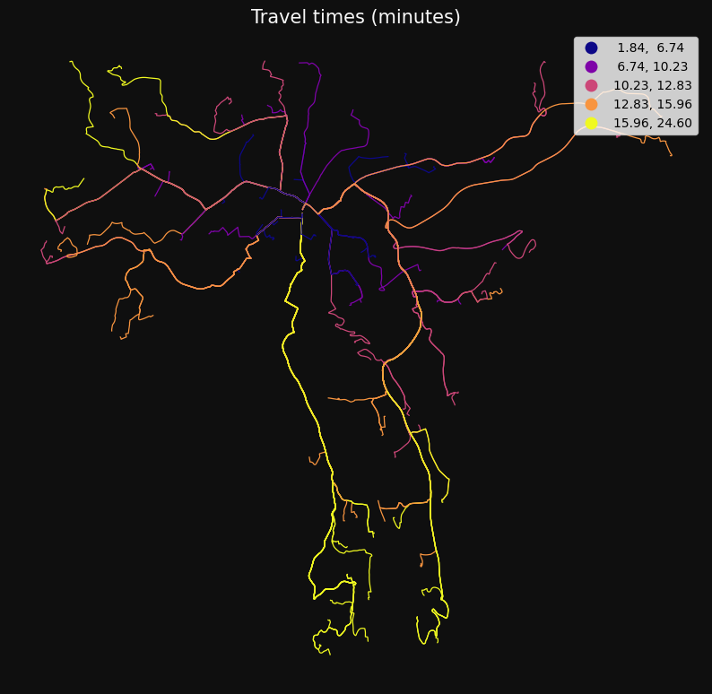
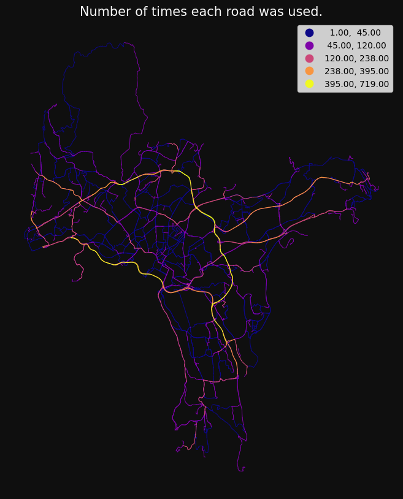

```python
import os
```

```python
import warnings

import geopandas as gpd
import numpy as np
import pandas as pd


os.chdir("../src")
import gis_utils as gs


os.chdir("..")

# ignore some warnings to make it cleaner
pd.options.mode.chained_assignment = None
warnings.filterwarnings(action="ignore", category=UserWarning)
warnings.filterwarnings(action="ignore", category=FutureWarning)
```

## Network analysis

The package supports four types of network analysis, and methods for customising and optimising road or other line data.

Analysis can start by initialising a NetworkAnalysis instance:

```python
from gis_utils import DirectedNetwork, NetworkAnalysis, NetworkAnalysisRules


roads = gpd.read_parquet("tests/testdata/roads_oslo_2022.parquet")

nw = (
    DirectedNetwork(roads)
    .remove_isolated()
    .make_directed_network(
        direction_col="oneway",
        direction_vals_bft=("B", "FT", "TF"),
        minute_cols=("drivetime_fw", "drivetime_bw"),
    )
)

rules = NetworkAnalysisRules(weight="minutes")

nwa = NetworkAnalysis(network=nw, rules=rules)

nwa
```

    NetworkAnalysis(network=DirectedNetwork(6364 km, directed=True), rules=NetworkAnalysisRules(weight='minutes', search_tolerance=250, search_factor=10, split_lines, ...))

```python
points = gpd.read_parquet("tests/testdata/random_points.parquet")
```

### od_cost_matrix

Fast many-to-many travel times/distances

```python
od = nwa.od_cost_matrix(points.iloc[[0]], points, lines=True)

gs.qtm(
    od,
    "minutes",
    title="Travel time (minutes) from 1 to 1000 points.",
)

od
```

<div>
<table border="1" class="dataframe">
  <thead>
    <tr style="text-align: right;">
      <th></th>
      <th>origin</th>
      <th>destination</th>
      <th>minutes</th>
      <th>geometry</th>
    </tr>
  </thead>
  <tbody>
    <tr>
      <th>0</th>
      <td>79166</td>
      <td>79167</td>
      <td>0.000000</td>
      <td>LINESTRING (263122.700 6651184.900, 263122.700...</td>
    </tr>
    <tr>
      <th>1</th>
      <td>79166</td>
      <td>79168</td>
      <td>12.930588</td>
      <td>LINESTRING (263122.700 6651184.900, 272456.100...</td>
    </tr>
    <tr>
      <th>2</th>
      <td>79166</td>
      <td>79169</td>
      <td>10.867076</td>
      <td>LINESTRING (263122.700 6651184.900, 270082.300...</td>
    </tr>
    <tr>
      <th>3</th>
      <td>79166</td>
      <td>79170</td>
      <td>8.075722</td>
      <td>LINESTRING (263122.700 6651184.900, 259804.800...</td>
    </tr>
    <tr>
      <th>4</th>
      <td>79166</td>
      <td>79171</td>
      <td>14.659333</td>
      <td>LINESTRING (263122.700 6651184.900, 272876.200...</td>
    </tr>
    <tr>
      <th>...</th>
      <td>...</td>
      <td>...</td>
      <td>...</td>
      <td>...</td>
    </tr>
    <tr>
      <th>995</th>
      <td>79166</td>
      <td>80162</td>
      <td>10.858519</td>
      <td>LINESTRING (263122.700 6651184.900, 266801.700...</td>
    </tr>
    <tr>
      <th>996</th>
      <td>79166</td>
      <td>80163</td>
      <td>7.461032</td>
      <td>LINESTRING (263122.700 6651184.900, 261274.000...</td>
    </tr>
    <tr>
      <th>997</th>
      <td>79166</td>
      <td>80164</td>
      <td>10.698588</td>
      <td>LINESTRING (263122.700 6651184.900, 263542.900...</td>
    </tr>
    <tr>
      <th>998</th>
      <td>79166</td>
      <td>80165</td>
      <td>10.109855</td>
      <td>LINESTRING (263122.700 6651184.900, 269226.700...</td>
    </tr>
    <tr>
      <th>999</th>
      <td>79166</td>
      <td>80166</td>
      <td>14.657289</td>
      <td>LINESTRING (263122.700 6651184.900, 264570.300...</td>
    </tr>
  </tbody>
</table>
<p>1000 rows × 4 columns</p>
</div>


### get_route

Get the actual paths:

```python
routes = nwa.get_route(points.iloc[[0]], points.sample(100), id_col="idx")

gs.qtm(
    gs.buff(routes, 15),
    "minutes",
    cmap="plasma",
    title="Travel times (minutes)",
)

routes
```

<div>
<table border="1" class="dataframe">
  <thead>
    <tr style="text-align: right;">
      <th></th>
      <th>origin</th>
      <th>destination</th>
      <th>minutes</th>
      <th>geometry</th>
    </tr>
  </thead>
  <tbody>
    <tr>
      <th>0</th>
      <td>1</td>
      <td>636</td>
      <td>19.412610</td>
      <td>MULTILINESTRING Z ((264483.115 6641395.801 80....</td>
    </tr>
    <tr>
      <th>1</th>
      <td>1</td>
      <td>807</td>
      <td>7.396186</td>
      <td>MULTILINESTRING Z ((262623.190 6652506.640 79....</td>
    </tr>
    <tr>
      <th>2</th>
      <td>1</td>
      <td>375</td>
      <td>11.968866</td>
      <td>MULTILINESTRING Z ((271536.782 6653211.344 133...</td>
    </tr>
    <tr>
      <th>3</th>
      <td>1</td>
      <td>75</td>
      <td>15.943349</td>
      <td>MULTILINESTRING Z ((266884.700 6643513.500 125...</td>
    </tr>
    <tr>
      <th>4</th>
      <td>1</td>
      <td>980</td>
      <td>16.001604</td>
      <td>MULTILINESTRING Z ((257040.874 6655187.835 179...</td>
    </tr>
    <tr>
      <th>...</th>
      <td>...</td>
      <td>...</td>
      <td>...</td>
      <td>...</td>
    </tr>
    <tr>
      <th>95</th>
      <td>1</td>
      <td>228</td>
      <td>2.902736</td>
      <td>MULTILINESTRING Z ((262082.600 6651528.500 74....</td>
    </tr>
    <tr>
      <th>96</th>
      <td>1</td>
      <td>725</td>
      <td>13.695252</td>
      <td>MULTILINESTRING Z ((261352.158 6649521.080 6.6...</td>
    </tr>
    <tr>
      <th>97</th>
      <td>1</td>
      <td>457</td>
      <td>13.142741</td>
      <td>MULTILINESTRING Z ((263171.800 6651250.200 46....</td>
    </tr>
    <tr>
      <th>98</th>
      <td>1</td>
      <td>792</td>
      <td>3.720288</td>
      <td>MULTILINESTRING Z ((261950.506 6650636.992 52....</td>
    </tr>
    <tr>
      <th>99</th>
      <td>1</td>
      <td>250</td>
      <td>2.545756</td>
      <td>MULTILINESTRING Z ((263486.400 6650553.200 30....</td>
    </tr>
  </tbody>
</table>
<p>100 rows × 4 columns</p>
</div>



### get_route_frequencies

Get the number of times each line segment was used:

```python
freq = nwa.get_route_frequencies(points.sample(100), points.sample(100))

gs.qtm(
    gs.buff(freq, 15),
    "n",
    scheme="naturalbreaks",
    cmap="plasma",
    title="Number of times each road was used.",
)
```



### Service area

Get the area that can be reached within one or more breaks.

```python
sa = nwa.service_area(points.iloc[[0]], breaks=np.arange(1, 11), id_col="idx")
sa
```

<div>
<table border="1" class="dataframe">
  <thead>
    <tr style="text-align: right;">
      <th></th>
      <th>minutes</th>
      <th>idx</th>
      <th>geometry</th>
    </tr>
  </thead>
  <tbody>
    <tr>
      <th>0</th>
      <td>1</td>
      <td>1</td>
      <td>MULTILINESTRING Z ((263405.137 6651352.537 56....</td>
    </tr>
    <tr>
      <th>1</th>
      <td>2</td>
      <td>1</td>
      <td>MULTILINESTRING Z ((263273.605 6652079.666 67....</td>
    </tr>
    <tr>
      <th>2</th>
      <td>3</td>
      <td>1</td>
      <td>MULTILINESTRING Z ((262750.930 6651840.320 63....</td>
    </tr>
    <tr>
      <th>3</th>
      <td>4</td>
      <td>1</td>
      <td>MULTILINESTRING Z ((261870.921 6651358.348 77....</td>
    </tr>
    <tr>
      <th>4</th>
      <td>5</td>
      <td>1</td>
      <td>MULTILINESTRING Z ((265378.000 6650581.600 85....</td>
    </tr>
    <tr>
      <th>5</th>
      <td>6</td>
      <td>1</td>
      <td>MULTILINESTRING Z ((265262.829 6650519.242 78....</td>
    </tr>
    <tr>
      <th>6</th>
      <td>7</td>
      <td>1</td>
      <td>MULTILINESTRING Z ((264348.673 6648271.134 17....</td>
    </tr>
    <tr>
      <th>7</th>
      <td>8</td>
      <td>1</td>
      <td>MULTILINESTRING Z ((264348.673 6648271.134 17....</td>
    </tr>
    <tr>
      <th>8</th>
      <td>9</td>
      <td>1</td>
      <td>MULTILINESTRING Z ((264348.673 6648271.134 17....</td>
    </tr>
    <tr>
      <th>9</th>
      <td>10</td>
      <td>1</td>
      <td>MULTILINESTRING Z ((264348.673 6648271.134 17....</td>
    </tr>
  </tbody>
</table>
</div>

By setting dissolve to False, we get the individual road segments, and can remove
duplicate rows to not have overlapping service areas.

```python
sa = nwa.service_area(points.iloc[[0]], breaks=np.arange(1, 11), dissolve=False)

sa = sa.drop_duplicates(["source", "target"])

gs.qtm(
    sa,
    "minutes",
    k=10,
    title="Roads that can be reached within 1 to 10 minutes",
    legend=False,
)
```


Check the log:

```python
nwa.log
```

<div>
<table border="1" class="dataframe">
  <thead>
    <tr style="text-align: right;">
      <th></th>
      <th>endtime</th>
      <th>minutes_elapsed</th>
      <th>method</th>
      <th>origins_count</th>
      <th>destinations_count</th>
      <th>percent_missing</th>
      <th>cost_mean</th>
      <th>isolated_removed</th>
      <th>percent_directional</th>
      <th>weight</th>
      <th>...</th>
      <th>cost_p25</th>
      <th>cost_median</th>
      <th>cost_p75</th>
      <th>cost_std</th>
      <th>lines</th>
      <th>cutoff</th>
      <th>destination_count</th>
      <th>rowwise</th>
      <th>breaks</th>
      <th>dissolve</th>
    </tr>
  </thead>
  <tbody>
    <tr>
      <th>0</th>
      <td>2023-02-27 20:46:36</td>
      <td>0.1</td>
      <td>od_cost_matrix</td>
      <td>1</td>
      <td>1000.0</td>
      <td>0.2</td>
      <td>11.286299</td>
      <td>True</td>
      <td>46</td>
      <td>minutes</td>
      <td>...</td>
      <td>7.660459</td>
      <td>11.573666</td>
      <td>14.151198</td>
      <td>5.091459</td>
      <td>True</td>
      <td>None</td>
      <td>None</td>
      <td>False</td>
      <td>NaN</td>
      <td>NaN</td>
    </tr>
    <tr>
      <th>1</th>
      <td>2023-02-27 20:46:59</td>
      <td>0.4</td>
      <td>get_route</td>
      <td>1</td>
      <td>100.0</td>
      <td>0.0</td>
      <td>11.451304</td>
      <td>True</td>
      <td>46</td>
      <td>minutes</td>
      <td>...</td>
      <td>7.380393</td>
      <td>11.915321</td>
      <td>15.200179</td>
      <td>5.323508</td>
      <td>NaN</td>
      <td>None</td>
      <td>None</td>
      <td>False</td>
      <td>NaN</td>
      <td>NaN</td>
    </tr>
    <tr>
      <th>2</th>
      <td>2023-02-27 20:51:53</td>
      <td>4.8</td>
      <td>get_route_frequencies</td>
      <td>100</td>
      <td>100.0</td>
      <td>NaN</td>
      <td>NaN</td>
      <td>True</td>
      <td>46</td>
      <td>minutes</td>
      <td>...</td>
      <td>NaN</td>
      <td>NaN</td>
      <td>NaN</td>
      <td>NaN</td>
      <td>NaN</td>
      <td>None</td>
      <td>None</td>
      <td>NaN</td>
      <td>NaN</td>
      <td>NaN</td>
    </tr>
    <tr>
      <th>3</th>
      <td>2023-02-27 20:52:31</td>
      <td>0.2</td>
      <td>service_area</td>
      <td>1</td>
      <td>NaN</td>
      <td>0.0</td>
      <td>5.500000</td>
      <td>True</td>
      <td>46</td>
      <td>minutes</td>
      <td>...</td>
      <td>3.250000</td>
      <td>5.500000</td>
      <td>7.750000</td>
      <td>3.027650</td>
      <td>NaN</td>
      <td>None</td>
      <td>None</td>
      <td>NaN</td>
      <td>1, 2, 3, 4, 5, 6, 7, 8, 9, 10</td>
      <td>True</td>
    </tr>
    <tr>
      <th>4</th>
      <td>2023-02-27 20:52:42</td>
      <td>0.1</td>
      <td>service_area</td>
      <td>1</td>
      <td>NaN</td>
      <td>0.0</td>
      <td>7.909540</td>
      <td>True</td>
      <td>46</td>
      <td>minutes</td>
      <td>...</td>
      <td>7.000000</td>
      <td>8.000000</td>
      <td>10.000000</td>
      <td>1.907413</td>
      <td>NaN</td>
      <td>NaN</td>
      <td>NaN</td>
      <td>NaN</td>
      <td>1, 2, 3, 4, 5, 6, 7, 8, 9, 10</td>
      <td>False</td>
    </tr>
  </tbody>
</table>
<p>5 rows × 26 columns</p>
</div>
