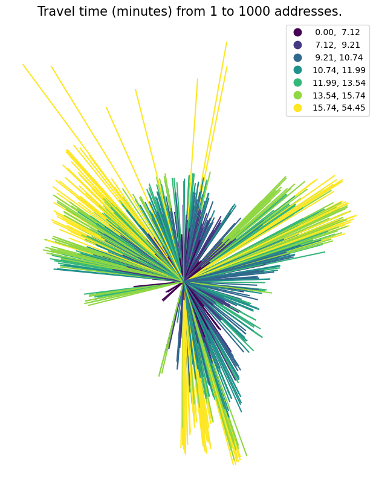
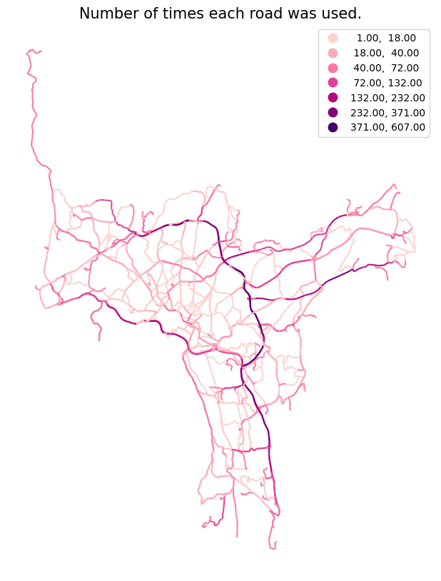
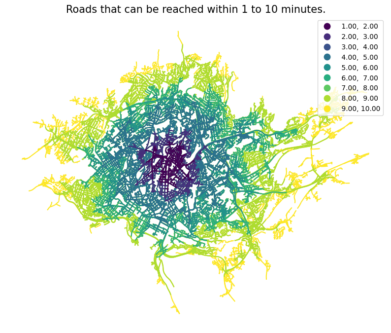
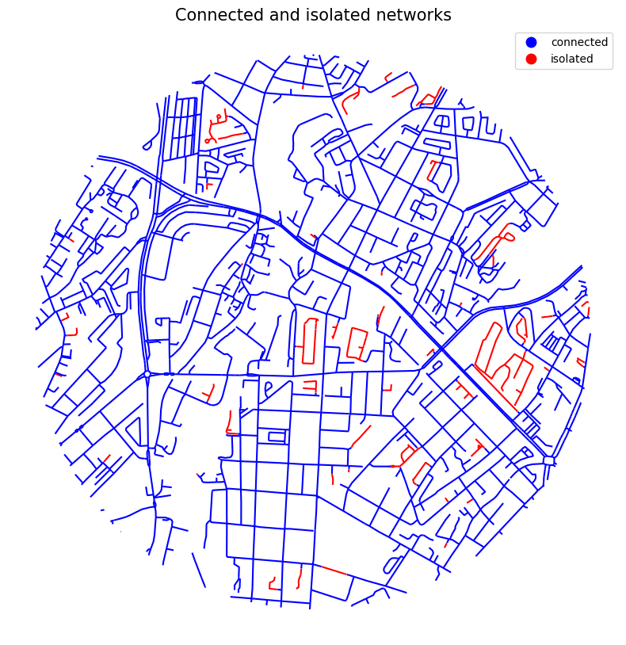

## Network analysis in ssb-gis-utils

##### igraph integrated with geopandas

The package supports three types of network analysis:

- od_cost_matrix: fast many-to-many travel times/distances
- shortest_path: returns the geometry of the lowest-cost paths.
- service_area: returns the roads that can be reached within one or more breaks.

```python
import warnings
import geopandas as gpd
import os
import pandas as pd
import numpy as np

os.chdir("../src")

import gis_utils as gs

os.chdir("..")
```

```python
# ignore some warnings to make it cleaner
pd.options.mode.chained_assignment = None
warnings.filterwarnings(action="ignore", category=UserWarning)
warnings.filterwarnings(action="ignore", category=FutureWarning)
```

At the core of the network analysis, is the NetworkAnalysis class.

It takes a network and a set of rules for the analysis:

```python
gs.NetworkAnalysis
```

    gis_utils.networkanalysis.NetworkAnalysis

The rules can be initialised like this:

```python
rules = gs.NetworkAnalysisRules(weight="minutes")
rules
```

    NetworkAnalysisRules(weight='minutes', search_tolerance=250, search_factor=10, weight_to_nodes_dist=False, weight_to_nodes_kmh=None, weight_to_nodes_mph=None)

To create the network, we need some road data:

```python
roads = gpd.read_parquet("tests/testdata/roads_oslo_2022.parquet")
roads = roads[["oneway", "drivetime_fw", "drivetime_bw", "geometry"]]
roads.head(3)
```

<div>
<table border="1" class="dataframe">
  <thead>
    <tr style="text-align: right;">
      <th></th>
      <th>oneway</th>
      <th>drivetime_fw</th>
      <th>drivetime_bw</th>
      <th>geometry</th>
    </tr>
  </thead>
  <tbody>
    <tr>
      <th>119702</th>
      <td>B</td>
      <td>0.216611</td>
      <td>0.216611</td>
      <td>MULTILINESTRING Z ((258028.440 6674249.890 413...</td>
    </tr>
    <tr>
      <th>199710</th>
      <td>FT</td>
      <td>0.099323</td>
      <td>-1.000000</td>
      <td>MULTILINESTRING Z ((271778.700 6653238.900 138...</td>
    </tr>
    <tr>
      <th>199725</th>
      <td>FT</td>
      <td>0.173963</td>
      <td>-1.000000</td>
      <td>MULTILINESTRING Z ((271884.510 6653207.540 142...</td>
    </tr>
  </tbody>
</table>
</div>

The road data can be made into a Network class instance like this:

```python
nw = gs.Network(roads)
nw
```

    Network class instance with 93395 rows and a length of 3851 km.

The Network is now ready for network analysis.

We can also optimise the network with methods stored in the Network class. More about this further down in this notebook.

```python
nw = nw.close_network_holes(1.5).remove_isolated().cut_lines(250)
nw
```

    Network class instance with 105288 rows and a length of 3832 km.

The GeoDataFrame is stored in the 'gdf' attribute:

```python
nw.gdf.head(3)
```

<div>
<table border="1" class="dataframe">
  <thead>
    <tr style="text-align: right;">
      <th></th>
      <th>oneway</th>
      <th>drivetime_fw</th>
      <th>drivetime_bw</th>
      <th>idx_orig</th>
      <th>source_wkt</th>
      <th>target_wkt</th>
      <th>source</th>
      <th>target</th>
      <th>n_source</th>
      <th>n_target</th>
      <th>hole</th>
      <th>connected</th>
      <th>geometry</th>
    </tr>
  </thead>
  <tbody>
    <tr>
      <th>0</th>
      <td>FT</td>
      <td>0.099323</td>
      <td>-1.0</td>
      <td>199710.0</td>
      <td>POINT (271778.7000000002 6653238.9)</td>
      <td>POINT (271884.5099999998 6653207.539999999)</td>
      <td>1</td>
      <td>2</td>
      <td>2.0</td>
      <td>4.0</td>
      <td>0</td>
      <td>1.0</td>
      <td>LINESTRING (271778.700 6653238.900, 271884.510...</td>
    </tr>
    <tr>
      <th>1</th>
      <td>FT</td>
      <td>0.173963</td>
      <td>-1.0</td>
      <td>199725.0</td>
      <td>POINT (271884.5099999998 6653207.539999999)</td>
      <td>POINT (272069.7999999998 6653152.5)</td>
      <td>2</td>
      <td>60241</td>
      <td>4.0</td>
      <td>2.0</td>
      <td>0</td>
      <td>1.0</td>
      <td>LINESTRING (271884.510 6653207.540, 272069.800...</td>
    </tr>
    <tr>
      <th>2</th>
      <td>FT</td>
      <td>0.011827</td>
      <td>-1.0</td>
      <td>199726.0</td>
      <td>POINT (271884.5099999998 6653207.539999999)</td>
      <td>POINT (271897.5999999996 6653208.699999999)</td>
      <td>2</td>
      <td>62844</td>
      <td>4.0</td>
      <td>3.0</td>
      <td>0</td>
      <td>1.0</td>
      <td>LINESTRING (271884.510 6653207.540, 271897.600...</td>
    </tr>
  </tbody>
</table>
</div>

For directed network analysis, the DirectedNetwork class can be used. This inherits all methods from the Network class, and also includes methods for making a directed network.

```python
nw = gs.DirectedNetwork(roads).remove_isolated()
nw
```

    DirectedNetwork class instance with 85638 rows and a length of 3407 km.

We now have a DirectedNetwork instance. However, the network isn't actually directed yet. The roads going both ways, only appear once, and the roads going backwards, have to be flipped around.

This can be done with the make_directed_network method:

```python
nw = nw.make_directed_network(
    direction_col="oneway",
    direction_vals_bft=("B", "FT", "TF"),
    speed_col=None,
    minute_cols=("drivetime_fw", "drivetime_bw"),
    flat_speed=None,
)
nw
```

    DirectedNetwork class instance with 160137 rows and a length of 6364 km.

The network has now almost doubled in length, since most roads are bidirectional in this network.

Norwegian road data can be made directional with a custom method:

```python
nw = (
    gs.DirectedNetwork(roads)
    .remove_isolated()
    .make_directed_network_norway()
)
nw
```

    DirectedNetwork class instance with 160137 rows and a length of 6364 km.

## NetworkAnalysis

To start the network analysis, we put our network and our rules into the NetworkAnalysis class:

```python
nwa = gs.NetworkAnalysis(
    network=nw, rules=rules
)
nwa
```

    NetworkAnalysis(weight=minutes, search_tolerance=250, search_factor=10)

We also need some points that will be our start- and endpoints:

```python
points = gpd.read_parquet("tests/testdata/random_points.parquet")
points
```

<div>
<table border="1" class="dataframe">
  <thead>
    <tr style="text-align: right;">
      <th></th>
      <th>idx</th>
      <th>geometry</th>
    </tr>
  </thead>
  <tbody>
    <tr>
      <th>0</th>
      <td>1</td>
      <td>POINT (263122.700 6651184.900)</td>
    </tr>
    <tr>
      <th>1</th>
      <td>2</td>
      <td>POINT (272456.100 6653369.500)</td>
    </tr>
    <tr>
      <th>2</th>
      <td>3</td>
      <td>POINT (270082.300 6653032.700)</td>
    </tr>
    <tr>
      <th>3</th>
      <td>4</td>
      <td>POINT (259804.800 6650339.700)</td>
    </tr>
    <tr>
      <th>4</th>
      <td>5</td>
      <td>POINT (272876.200 6652889.100)</td>
    </tr>
    <tr>
      <th>...</th>
      <td>...</td>
      <td>...</td>
    </tr>
    <tr>
      <th>995</th>
      <td>996</td>
      <td>POINT (266801.700 6647844.500)</td>
    </tr>
    <tr>
      <th>996</th>
      <td>997</td>
      <td>POINT (261274.000 6653593.400)</td>
    </tr>
    <tr>
      <th>997</th>
      <td>998</td>
      <td>POINT (263542.900 6645427.000)</td>
    </tr>
    <tr>
      <th>998</th>
      <td>999</td>
      <td>POINT (269226.700 6650628.000)</td>
    </tr>
    <tr>
      <th>999</th>
      <td>1000</td>
      <td>POINT (264570.300 6644239.500)</td>
    </tr>
  </tbody>
</table>
<p>1000 rows × 2 columns</p>
</div>

### OD cost matrix

od_cost_matrix calculates the traveltime from a set of startpoints to a set of endpoints:

```python
od = nwa.od_cost_matrix(points, points, id_col="idx")
od
```

<div>
<table border="1" class="dataframe">
  <thead>
    <tr style="text-align: right;">
      <th></th>
      <th>origin</th>
      <th>destination</th>
      <th>minutes</th>
    </tr>
  </thead>
  <tbody>
    <tr>
      <th>0</th>
      <td>1</td>
      <td>1</td>
      <td>0.000000</td>
    </tr>
    <tr>
      <th>1</th>
      <td>1</td>
      <td>2</td>
      <td>12.930588</td>
    </tr>
    <tr>
      <th>2</th>
      <td>1</td>
      <td>3</td>
      <td>10.867076</td>
    </tr>
    <tr>
      <th>3</th>
      <td>1</td>
      <td>4</td>
      <td>8.075722</td>
    </tr>
    <tr>
      <th>4</th>
      <td>1</td>
      <td>5</td>
      <td>14.659333</td>
    </tr>
    <tr>
      <th>...</th>
      <td>...</td>
      <td>...</td>
      <td>...</td>
    </tr>
    <tr>
      <th>999995</th>
      <td>1000</td>
      <td>996</td>
      <td>10.936357</td>
    </tr>
    <tr>
      <th>999996</th>
      <td>1000</td>
      <td>997</td>
      <td>17.476000</td>
    </tr>
    <tr>
      <th>999997</th>
      <td>1000</td>
      <td>998</td>
      <td>10.288465</td>
    </tr>
    <tr>
      <th>999998</th>
      <td>1000</td>
      <td>999</td>
      <td>14.798257</td>
    </tr>
    <tr>
      <th>999999</th>
      <td>1000</td>
      <td>1000</td>
      <td>0.000000</td>
    </tr>
  </tbody>
</table>
<p>1000000 rows × 3 columns</p>
</div>

Set 'lines' to True to get straight lines between origin and destination:

```python
od = nwa.od_cost_matrix(points.sample(1), points, lines=True)

gs.qtm(
    od,
    "minutes",
    title="Travel time (minutes) from 1 to 1000 addresses.",
    k=7,
)
```



### Shortest path

The shortest_path method can be used to get the actual paths:

```python
sp = nwa.shortest_path(points.iloc[[0]], points.sample(100), id_col="idx")

gs.qtm(sp, "minutes", cmap=gs.chop_cmap("RdPu", 0.2), title="Travel times (minutes)")

sp
```

<div>
<table border="1" class="dataframe">
  <thead>
    <tr style="text-align: right;">
      <th></th>
      <th>origin</th>
      <th>destination</th>
      <th>minutes</th>
      <th>geometry</th>
    </tr>
  </thead>
  <tbody>
    <tr>
      <th>0</th>
      <td>1</td>
      <td>553</td>
      <td>1.214820</td>
      <td>MULTILINESTRING Z ((263191.940 6650704.850 25....</td>
    </tr>
    <tr>
      <th>1</th>
      <td>1</td>
      <td>56</td>
      <td>8.524345</td>
      <td>MULTILINESTRING Z ((260679.000 6651295.200 48....</td>
    </tr>
    <tr>
      <th>2</th>
      <td>1</td>
      <td>738</td>
      <td>6.774958</td>
      <td>MULTILINESTRING Z ((261867.900 6650493.300 47....</td>
    </tr>
    <tr>
      <th>3</th>
      <td>1</td>
      <td>623</td>
      <td>12.468534</td>
      <td>MULTILINESTRING Z ((263171.800 6651250.200 46....</td>
    </tr>
    <tr>
      <th>4</th>
      <td>1</td>
      <td>121</td>
      <td>13.405679</td>
      <td>MULTILINESTRING Z ((265975.500 6644787.700 161...</td>
    </tr>
    <tr>
      <th>...</th>
      <td>...</td>
      <td>...</td>
      <td>...</td>
      <td>...</td>
    </tr>
    <tr>
      <th>94</th>
      <td>1</td>
      <td>328</td>
      <td>6.777099</td>
      <td>MULTILINESTRING Z ((268037.994 6652561.378 157...</td>
    </tr>
    <tr>
      <th>95</th>
      <td>1</td>
      <td>508</td>
      <td>21.051914</td>
      <td>MULTILINESTRING Z ((266999.100 6640759.200 133...</td>
    </tr>
    <tr>
      <th>96</th>
      <td>1</td>
      <td>533</td>
      <td>13.493656</td>
      <td>MULTILINESTRING Z ((257711.039 6654032.042 146...</td>
    </tr>
    <tr>
      <th>97</th>
      <td>1</td>
      <td>430</td>
      <td>14.969325</td>
      <td>MULTILINESTRING Z ((265209.481 6643646.566 136...</td>
    </tr>
    <tr>
      <th>98</th>
      <td>1</td>
      <td>731</td>
      <td>11.256682</td>
      <td>MULTILINESTRING Z ((261276.828 6654115.849 146...</td>
    </tr>
  </tbody>
</table>
<p>99 rows × 4 columns</p>
</div>


Set 'summarise' to True to get the number of times each road segment was used. This is faster than not summarising, because no dissolve is done.

```python
sp = nwa.shortest_path(points.sample(50), points.sample(50), summarise=True)

gs.qtm(
    sp,
    "n",
    scheme="naturalbreaks",
    k=7,
    cmap=gs.chop_cmap("RdPu", 0.2),
    title="Number of times each road was used.",
)
```



### Service area

The service_area method finds the area that can be reached within one or more breaks.

Here, we find the areas that can be reached within 5, 10 and 15 minutes for five random points:

```python
sa = nwa.service_area(points.sample(5), breaks=(5, 10, 15), id_col="idx")
sa
```

<div>
<table border="1" class="dataframe">
  <thead>
    <tr style="text-align: right;">
      <th></th>
      <th>minutes</th>
      <th>idx</th>
      <th>geometry</th>
    </tr>
  </thead>
  <tbody>
    <tr>
      <th>0</th>
      <td>5</td>
      <td>731</td>
      <td>MULTILINESTRING Z ((261416.340 6653760.610 108...</td>
    </tr>
    <tr>
      <th>1</th>
      <td>10</td>
      <td>731</td>
      <td>MULTILINESTRING Z ((259185.676 6652656.707 76....</td>
    </tr>
    <tr>
      <th>2</th>
      <td>15</td>
      <td>731</td>
      <td>MULTILINESTRING Z ((266909.769 6651075.250 114...</td>
    </tr>
    <tr>
      <th>3</th>
      <td>5</td>
      <td>424</td>
      <td>MULTILINESTRING Z ((265894.871 6643331.708 113...</td>
    </tr>
    <tr>
      <th>4</th>
      <td>10</td>
      <td>424</td>
      <td>MULTILINESTRING Z ((266382.600 6639604.600 -99...</td>
    </tr>
    <tr>
      <th>5</th>
      <td>15</td>
      <td>424</td>
      <td>MULTILINESTRING Z ((266382.600 6639604.600 -99...</td>
    </tr>
    <tr>
      <th>6</th>
      <td>5</td>
      <td>462</td>
      <td>MULTILINESTRING Z ((256284.280 6651413.280 84....</td>
    </tr>
    <tr>
      <th>7</th>
      <td>10</td>
      <td>462</td>
      <td>MULTILINESTRING Z ((256747.750 6655744.370 182...</td>
    </tr>
    <tr>
      <th>8</th>
      <td>15</td>
      <td>462</td>
      <td>MULTILINESTRING Z ((264348.673 6648271.134 17....</td>
    </tr>
    <tr>
      <th>9</th>
      <td>5</td>
      <td>851</td>
      <td>MULTILINESTRING Z ((264348.673 6648271.134 17....</td>
    </tr>
    <tr>
      <th>10</th>
      <td>10</td>
      <td>851</td>
      <td>MULTILINESTRING Z ((264348.673 6648271.134 17....</td>
    </tr>
    <tr>
      <th>11</th>
      <td>15</td>
      <td>851</td>
      <td>MULTILINESTRING Z ((264348.673 6648271.134 17....</td>
    </tr>
    <tr>
      <th>12</th>
      <td>5</td>
      <td>662</td>
      <td>MULTILINESTRING Z ((264802.500 6653645.400 184...</td>
    </tr>
    <tr>
      <th>13</th>
      <td>10</td>
      <td>662</td>
      <td>MULTILINESTRING Z ((264348.673 6648271.134 17....</td>
    </tr>
    <tr>
      <th>14</th>
      <td>15</td>
      <td>662</td>
      <td>MULTILINESTRING Z ((264348.673 6648271.134 17....</td>
    </tr>
  </tbody>
</table>
</div>

```python
sa = nwa.service_area(points.iloc[[0]], breaks=np.arange(1, 11)).sort_values(
    "minutes", ascending=False
)
gs.qtm(sa, "minutes", k=9, title="Roads that can be reached within 1 to 10 minutes.")
```



Set 'dissolve' to False to get every road segment returned, one for each service area that uses the segment. If there are a lot of overlapping service areas, that are to be dissolved in the end, removing duplicates first will make things a whole lot faster.

```python
sa = nwa.service_area(points.sample(250), breaks=5, dissolve=False)

print("rows with duplicates:", len(sa))

sa = sa.drop_duplicates(["source", "target"])

print("rows without duplicates:", len(sa))

gs.qtm(sa)
```

    rows with duplicates: 1622322
    rows without duplicates: 151362


### Customising the network

```python
nw = gs.Network(roads)
nw
```

    Network class instance with 93395 rows and a length of 3851 km.

Networks often consist of one large, connected network and many small, isolated "network islands".

Start- and endpoints located inside these isolated networks, will have a hard time finding their way out.

The large, connected network component can be found (not removed) with the method get_largest_component:

```python
nw = nw.get_largest_component()

nw.gdf["connected_str"] = np.where(nw.gdf.connected==1, "connected", "isolated")

gs.clipmap(
    nw.gdf,
    points.iloc[[0]].buffer(1000),
    column="connected_str",
    title="Connected and isolated networks",
    cmap="bwr",
    explore=False,
)
```



Use the remove_isolated method to remove the unconnected roads:

```python
nwa = gs.NetworkAnalysis(network=nw, rules=gs.NetworkAnalysisRules(weight="meters"))
od = nwa.od_cost_matrix(points, points)
percent_missing = od[nwa.rules.weight].isna().mean() * 100
print(f"Before removing isolated: {percent_missing=:.2f}")
```

    Before removing isolated: percent_missing=11.44

```python
nwa.network = nwa.network.remove_isolated()

od = nwa.od_cost_matrix(points, points)
percent_missing = od[nwa.rules.weight].isna().mean() * 100
print(f"After removing isolated: {percent_missing=:.2f}")
```

    After removing isolated: percent_missing=0.40

If the road data has some gaps between the segments, these can be filled with straight lines:

```python
nw = nw.close_network_holes(max_dist=1.5)  # meters
nw
```

    Network class instance with 86929 rows and a length of 3408 km.

The network analysis is done from node to node. In a service area analysis, the results will be inaccurate for long lines, since the endpoint will either be reached or not within the breaks. This can be fixed by cutting all lines to a maximum distance.

Note: cutting the lines can take a lot of time for large networks and low cut distances.

```python
nw = nw.cut_lines(100)  # meters
nw.gdf.length.max()
```

    100.00000000046512

## The NetworkAnalysisRules

#### weight

The weight parameter has to be specified. This can be the name of any numeric column in network.gdf.

Or, if the weight is 'meters' or 'metres', a meter column will be created. The coordinate reference system of the network has to be meters as well.

```python
rules = gs.NetworkAnalysisRules(weight="metres")
gs.NetworkAnalysis(nw, rules=rules).network.gdf["metres"]
```

    0          13.141298
    1          10.107394
    2          49.406722
    3          12.147336
    4          13.408651
                 ...
    113289    100.000000
    113290     26.221654
    113291    100.000000
    113292    100.000000
    113293     71.447336
    Name: metres, Length: 113294, dtype: float64

If you want other distance units, create the column beforehand.

```python
nw.gdf = (
    nw.gdf.to_crs(6576)
    .assign(feet=lambda x: x.length)
)
rules = gs.NetworkAnalysisRules(weight="feet")
gs.NetworkAnalysis(nw, rules=rules).network.gdf.feet
```

    0          47.837387
    1          36.793277
    2         179.776090
    3          44.200535
    4          48.790062
                 ...
    113289    363.981826
    113290     95.441608
    113291    363.968502
    113292    363.969071
    113293    260.046583
    Name: feet, Length: 113294, dtype: float64

A 'minutes' column can be created with the make_directed_network method, where you specify the direction column, the values of the column (both ways, from, to).

To get the minutes, specify either minute_cols (one or two columns), a speed limit column or a flat speed to use for the entire network (if the travel mode is walking, bike, boat etc.).

```python
nw = (
    gs.DirectedNetwork(roads)
    .remove_isolated()
    .make_directed_network(
        direction_col="oneway",
        direction_vals_bft=("B", "FT", "TF"),
        speed_col=None,
        minute_cols=("drivetime_fw", "drivetime_bw"),
        flat_speed=None,
    )
)

nw.gdf['minutes']
```

    0         0.028421
    1         0.047592
    2         0.026180
    3         0.023978
    4         0.058472
                ...
    160188    0.007564
    160189    0.020246
    160190    0.036810
    160191    0.003019
    160192    0.036975
    Name: minutes, Length: 160137, dtype: float64

The NetworkAnalysisRules class also has some parameters with default values.

#### search_tolerance

search_tolerance is the maximum distance a start- or endpoint can be from the network. If the closest node is above the search_tolerance, this point will not be eligable for the analysis.

The default is:

```python
rules.search_tolerance
```

    250

The search_tolerance unit is meters if the units of the crs is meters, which it is in this case:

```python
nw.gdf.crs.axis_info[0].unit_name
```

    'metre'

Let's check how the search_tolerance influences the number of missing values:

```python
rules = gs.NetworkAnalysisRules(weight="minutes")
nwa = gs.NetworkAnalysis(nw, rules=rules)

for search_tolerance in [100, 250, 500, 5000]:
    nwa.rules.search_tolerance = search_tolerance
    od = nwa.od_cost_matrix(points.iloc[:100], points)
    percent_missing = od[nwa.rules.weight].isna().mean() * 100
    print(f"{search_tolerance=}, {percent_missing=:.2f}")

nwa.rules.search_tolerance = 250
```

    search_tolerance=100, percent_missing=4.86
    search_tolerance=250, percent_missing=3.19
    search_tolerance=500, percent_missing=2.10
    search_tolerance=5000, percent_missing=2.00

#### search_factor

Since the closest node might be intraversable, the points are connected to all nodes within a given search_factor. The default is 10, which means that 10 meters and 10 percent is added to the closest distance to a node.

So if the closest node is 1 meter away, the point will be connected to all nodes within 11.1 meters.

If the closest node is 100 meters away, the point will be connected to all nodes within 120 meters.

```python
# to connect the points only to the closest node:
gs.NetworkAnalysisRules(weight="meters", search_factor=0)
```

    NetworkAnalysisRules(weight='meters', search_tolerance=250, search_factor=0, weight_to_nodes_dist=False, weight_to_nodes_kmh=None, weight_to_nodes_mph=None)

Let's check how the search_factor influences the number of missing values:

```python
for search_factor in [0, 10, 25, 50]:
    nwa.rules.search_factor = search_factor
    od = nwa.od_cost_matrix(points.iloc[:100], points)
    percent_missing = od[nwa.rules.weight].isna().mean() * 100
    print(f"{search_factor=}, {percent_missing=:.2f}")

nwa.rules.search_factor = 10
```

    search_factor=0, percent_missing=3.38
    search_factor=10, percent_missing=3.19
    search_factor=25, percent_missing=2.19
    search_factor=50, percent_missing=1.20

#### weight*to_nodes*

Lastly, the class has three 'weight*to_nodes*' parameters. This is about the cost between the start- and endpoints and the network nodes. All three paramters are set to False or None by default, meaning the cost will be 0.

This will produce inaccurate results for points that are far away from the network. Therefore, you can set one of the 'weight*to_nodes*' parameters. If the weight is 'meters' (i.e. the length unit of the crs), setting 'weight_to_nodes_dist' to True will make the weight equivelant to the straight-line distance:

```python
gs.NetworkAnalysisRules(weight="meters", weight_to_nodes_dist=True)
```

    NetworkAnalysisRules(weight='meters', search_tolerance=250, search_factor=10, weight_to_nodes_dist=True, weight_to_nodes_kmh=None, weight_to_nodes_mph=None)

If the weight is "minutes", you specify the speed in kilometers or miles per hour:

```python
gs.NetworkAnalysisRules(weight="minutes", weight_to_nodes_kmh=5)
```

    NetworkAnalysisRules(weight='minutes', search_tolerance=250, search_factor=10, weight_to_nodes_dist=False, weight_to_nodes_kmh=5, weight_to_nodes_mph=None)

```python
gs.NetworkAnalysisRules(weight="minutes", weight_to_nodes_mph=3)
```

    NetworkAnalysisRules(weight='minutes', search_tolerance=250, search_factor=10, weight_to_nodes_dist=False, weight_to_nodes_kmh=None, weight_to_nodes_mph=3)

Let's check how the speed to the nodes influences the average speed:

```python
for weight_to_nodes_kmh in [5, 20, 50, 0]:
    nwa.rules.weight_to_nodes_kmh = weight_to_nodes_kmh
    od = nwa.od_cost_matrix(points.iloc[:100], points)
    mean_travel_time = od[nwa.rules.weight].mean()
    print(f"{weight_to_nodes_kmh=}, {mean_travel_time=:.3f}")
```

    weight_to_nodes_kmh=5, mean_travel_time=15.491
    weight_to_nodes_kmh=20, mean_travel_time=14.999
    weight_to_nodes_kmh=50, mean_travel_time=14.895
    weight_to_nodes_kmh=0, mean_travel_time=14.826
