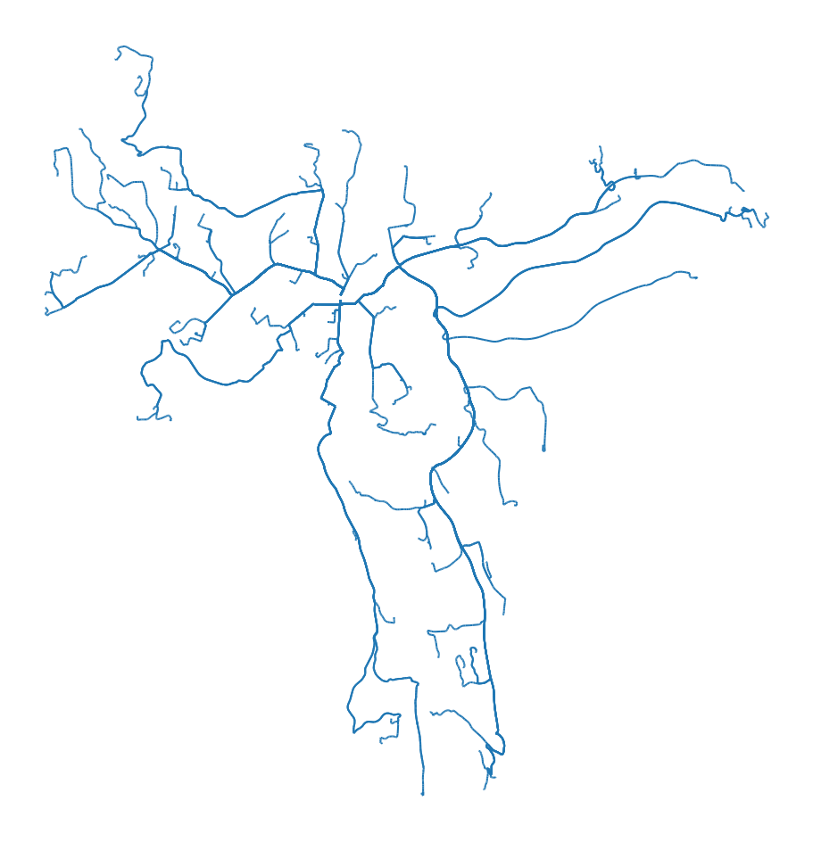
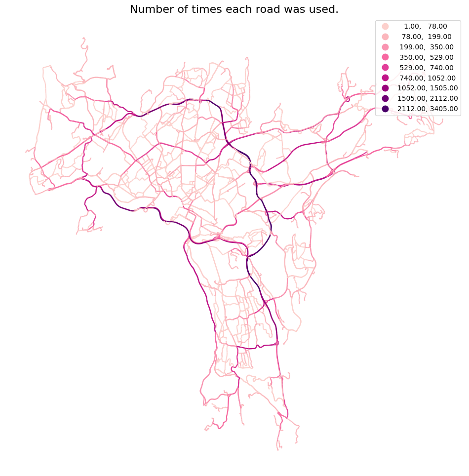
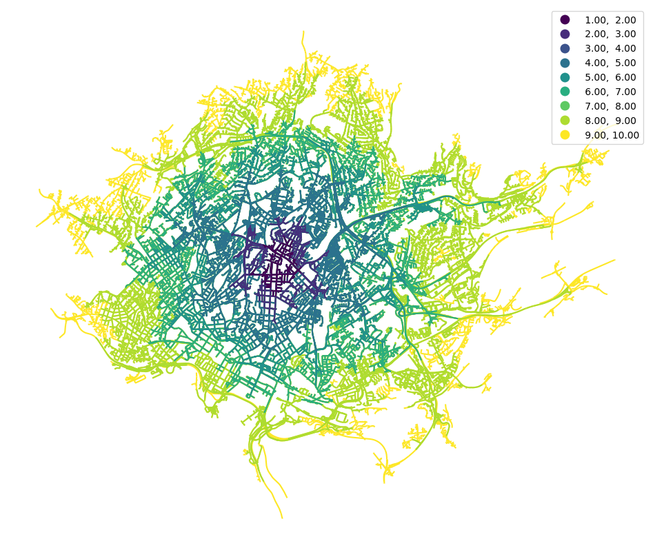
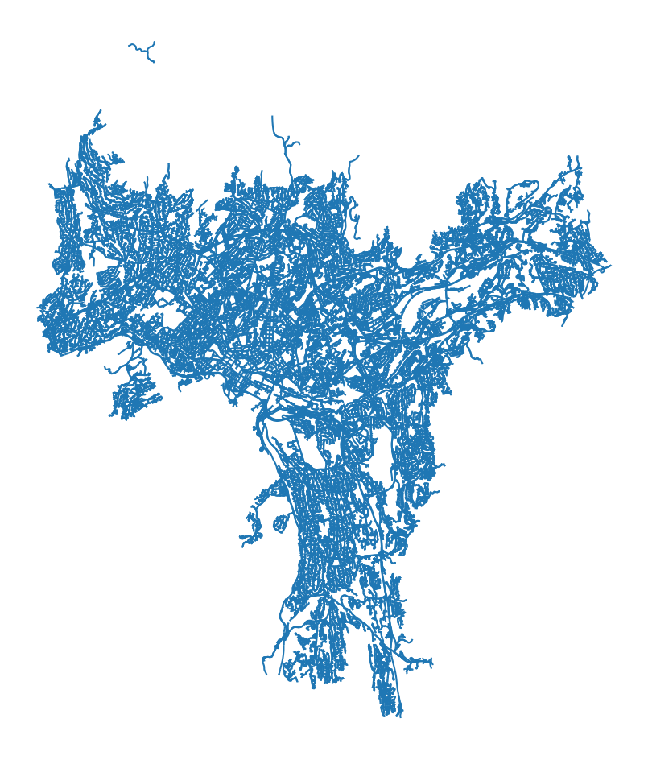
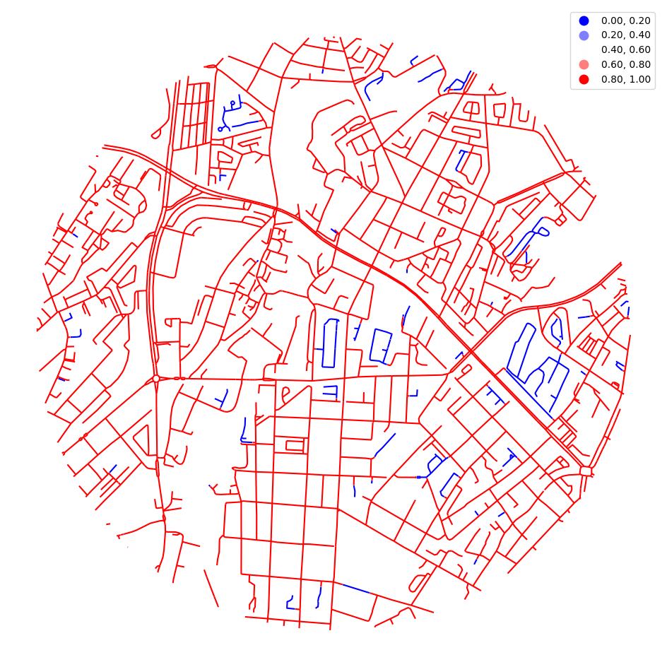
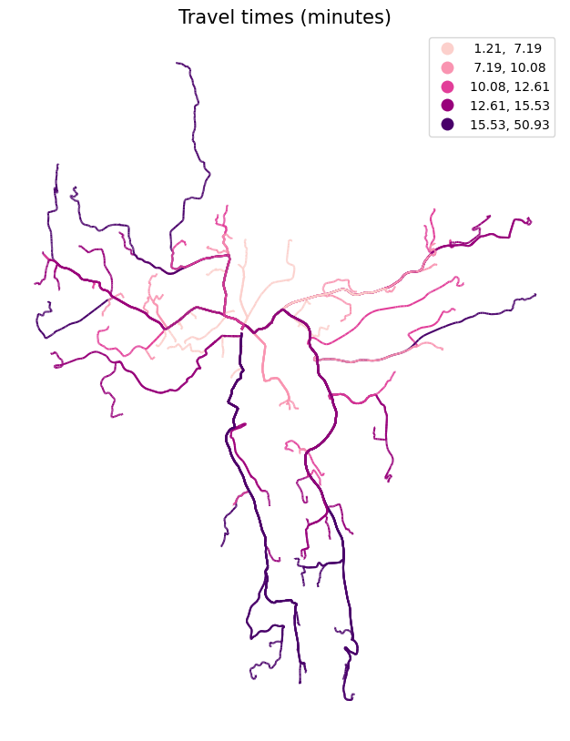

## Network analysis with ssb-gis-utils

Network analysis with igraph, integrated with geopandas.

The package supports three types of network analysis:
- od_cost_matrix: fast many-to-many travel times/distances
- shortest_path: returns the geometry of the lowest-cost paths.
- service_area: returns the roads that can be reached within one or more impedances.


```python

import geopandas as gpd
import numpy as np
import pandas as pd
import matplotlib.pyplot as plt

pd.options.mode.chained_assignment = None  # ignore SettingWithCopyWarning for now

import os

os.chdir("../src")

import gis_utils as gs

os.chdir("..")

# gs.__version__
```


```python
points = gpd.read_parquet("tests/testdata/random_points.parquet")
p = points.iloc[[0]]
```


```python
roads = gpd.read_parquet("tests/testdata/roads_oslo_2022.parquet")
roads = roads[["oneway", "drivetime_fw", "drivetime_bw", "geometry"]]
roads.head(3)
```


<div>
<style scoped>
    .dataframe tbody tr th:only-of-type {
        vertical-align: middle;
    }

    .dataframe tbody tr th {
        vertical-align: top;
    }

    .dataframe thead th {
        text-align: right;
    }
</style>
<table border="1" class="dataframe">
  <thead>
    <tr style="text-align: right;">
      <th></th>
      <th>oneway</th>
      <th>drivetime_fw</th>
      <th>drivetime_bw</th>
      <th>geometry</th>
    </tr>
  </thead>
  <tbody>
    <tr>
      <th>119702</th>
      <td>B</td>
      <td>0.216611</td>
      <td>0.216611</td>
      <td>MULTILINESTRING Z ((258028.440 6674249.890 413...</td>
    </tr>
    <tr>
      <th>199710</th>
      <td>FT</td>
      <td>0.099323</td>
      <td>-1.000000</td>
      <td>MULTILINESTRING Z ((271778.700 6653238.900 138...</td>
    </tr>
    <tr>
      <th>199725</th>
      <td>FT</td>
      <td>0.173963</td>
      <td>-1.000000</td>
      <td>MULTILINESTRING Z ((271884.510 6653207.540 142...</td>
    </tr>
  </tbody>
</table>
</div>


## The Network


```python
nw = gs.Network(roads)
nw
```


    Network class instance with 93395 rows and a length of 3851 km.


```python
nw.gdf.head(3)
```


<div>
<style scoped>
    .dataframe tbody tr th:only-of-type {
        vertical-align: middle;
    }

    .dataframe tbody tr th {
        vertical-align: top;
    }

    .dataframe thead th {
        text-align: right;
    }
</style>
<table border="1" class="dataframe">
  <thead>
    <tr style="text-align: right;">
      <th></th>
      <th>oneway</th>
      <th>drivetime_fw</th>
      <th>drivetime_bw</th>
      <th>idx_orig</th>
      <th>geometry</th>
      <th>source_wkt</th>
      <th>target_wkt</th>
      <th>source</th>
      <th>target</th>
      <th>n_source</th>
      <th>n_target</th>
    </tr>
  </thead>
  <tbody>
    <tr>
      <th>0</th>
      <td>B</td>
      <td>0.216611</td>
      <td>0.216611</td>
      <td>119702</td>
      <td>LINESTRING Z (258028.440 6674249.890 413.751, ...</td>
      <td>POINT (258028.4400000004 6674249.890000001)</td>
      <td>POINT (258023.5 6674213.59)</td>
      <td>0</td>
      <td>49540</td>
      <td>1</td>
      <td>2</td>
    </tr>
    <tr>
      <th>1</th>
      <td>FT</td>
      <td>0.099323</td>
      <td>-1.000000</td>
      <td>199710</td>
      <td>LINESTRING Z (271778.700 6653238.900 138.671, ...</td>
      <td>POINT (271778.7000000002 6653238.9)</td>
      <td>POINT (271884.5099999998 6653207.539999999)</td>
      <td>1</td>
      <td>2</td>
      <td>2</td>
      <td>4</td>
    </tr>
    <tr>
      <th>2</th>
      <td>FT</td>
      <td>0.173963</td>
      <td>-1.000000</td>
      <td>199725</td>
      <td>LINESTRING Z (271884.510 6653207.540 142.211, ...</td>
      <td>POINT (271884.5099999998 6653207.539999999)</td>
      <td>POINT (272069.7999999998 6653152.5)</td>
      <td>2</td>
      <td>60241</td>
      <td>4</td>
      <td>2</td>
    </tr>
  </tbody>
</table>
</div>


The network class includes methods for customising the road data. More about this further down in this notebook.


```python
nw = (
    nw.close_network_holes(1.5)
    .remove_isolated()
    # .cut_lines(25)
)
nw
```


    Network class instance with 100337 rows and a length of 3832 km.


For directed network analysis, the DirectedNetwork class can be used. This inherits all methods from the Network class, and also includes methods for making a directed network.


```python
nw = gs.DirectedNetwork(roads).remove_isolated()
nw
```

    c:\Users\ort\git\ssb-gis-utils\src\gis_utils\directednetwork.py:31: UserWarning: 
    Your network does not seem to be directed. 
    Try running 'make_directed_network' or 'make_directed_network_osm'.
    With 'make_directed_network', specify the direction column (e.g. 'oneway'),
    and the values of directions 'both', 'from', 'to' in a tuple (e.g. ("B", "F", "T")).
                
      warnings.warn(
    


    DirectedNetwork class instance with 85638 rows and 12 columns.


The above warning suggests that the data might not be directed yet. This is correct. The roads going both ways, only appear once, and the roads going backwards, have to be flipped around. 

This can be done in the make_directed_network method. 


```python
nw2 = nw.copy()
nw2 = nw2.make_directed_network(
    direction_col="oneway",
    direction_vals_bft=("B", "FT", "TF"),
    speed_col=None,
    minute_cols=("drivetime_fw", "drivetime_bw"),
    flat_speed=None,
)
nw2
```


    DirectedNetwork class instance with 160137 rows and 13 columns.


The roads now have almost twice as many rows, since most roads are bidirectional in this network.

OpenStreetMap road data and Norwegian road network can be made directional with custom methods, where the default parameters should give the correct results:


```python
# nw.make_directed_network_osm()
```


```python
nw = nw.make_directed_network_norway()
nw
```


    DirectedNetwork class instance with 160137 rows and 13 columns.


## NetworkAnalysis

The NetworkAnalysis class takes a network (created above) and some rules. 

This will set the rules to its default values:


```python
rules = gs.NetworkAnalysisRules(cost="minutes")
rules
```


    NetworkAnalysisRules(cost=minutes, search_tolerance=250, search_factor=10, cost_to_nodes=5)


Now we have what we need to start the network analysis.


```python
nwa = gs.NetworkAnalysis(
    network=nw,
    rules=rules
)
nwa
```


    
    NetworkAnalysis(cost=minutes, search_tolerance=250, search_factor=10, cost_to_nodes=5)


```python
od = nwa.od_cost_matrix(points, points, id_col="idx")
od
```


<div>
<style scoped>
    .dataframe tbody tr th:only-of-type {
        vertical-align: middle;
    }

    .dataframe tbody tr th {
        vertical-align: top;
    }

    .dataframe thead th {
        text-align: right;
    }
</style>
<table border="1" class="dataframe">
  <thead>
    <tr style="text-align: right;">
      <th></th>
      <th>origin</th>
      <th>destination</th>
      <th>minutes</th>
    </tr>
  </thead>
  <tbody>
    <tr>
      <th>0</th>
      <td>1</td>
      <td>1</td>
      <td>0.000000</td>
    </tr>
    <tr>
      <th>1</th>
      <td>1</td>
      <td>2</td>
      <td>14.163117</td>
    </tr>
    <tr>
      <th>2</th>
      <td>1</td>
      <td>3</td>
      <td>11.855891</td>
    </tr>
    <tr>
      <th>3</th>
      <td>1</td>
      <td>4</td>
      <td>9.260018</td>
    </tr>
    <tr>
      <th>4</th>
      <td>1</td>
      <td>5</td>
      <td>15.655043</td>
    </tr>
    <tr>
      <th>...</th>
      <td>...</td>
      <td>...</td>
      <td>...</td>
    </tr>
    <tr>
      <th>999995</th>
      <td>1000</td>
      <td>996</td>
      <td>11.372221</td>
    </tr>
    <tr>
      <th>999996</th>
      <td>1000</td>
      <td>997</td>
      <td>18.345221</td>
    </tr>
    <tr>
      <th>999997</th>
      <td>1000</td>
      <td>998</td>
      <td>10.666018</td>
    </tr>
    <tr>
      <th>999998</th>
      <td>1000</td>
      <td>999</td>
      <td>15.173808</td>
    </tr>
    <tr>
      <th>999999</th>
      <td>1000</td>
      <td>1000</td>
      <td>0.000000</td>
    </tr>
  </tbody>
</table>
<p>1000000 rows × 3 columns</p>
</div>


```python
gs.qtm(
    nwa.od_cost_matrix(points.sample(1), points, lines=True),
    "minutes",
    title="Travel time (minutes) from 1 to 1000 addresses.",
    k=7,
)
```


    

    


```python
sp = nwa.shortest_path(points.iloc[[0]], points.sample(100), id_col="idx")

gs.qtm(sp)
```


    

    


```python
from matplotlib.colors import LinearSegmentedColormap


def chop_cmap_frac(
    cmap: LinearSegmentedColormap, frac: float
) -> LinearSegmentedColormap:
    """Chops off the beginning `frac` fraction of a colormap."""
    cmap = plt.get_cmap(cmap)
    cmap_as_array = cmap(np.arange(256))
    cmap_as_array = cmap_as_array[int(frac * len(cmap_as_array)) :]
    return LinearSegmentedColormap.from_list(cmap.name + f"_frac{frac}", cmap_as_array)


cmap = chop_cmap_frac("RdPu", 0.2)

sp = nwa.shortest_path(points.sample(150), points.sample(150), summarise=True)

gs.qtm(
    sp,
    "n",
    scheme="naturalbreaks",
    k=7,
    cmap=cmap,
    title="Number of times each road was used.",
)
```


    

    


```python
sa = nwa.service_area(points.sample(5), impedance=(5, 10, 15), id_col="idx")
sa
```


<div>
<style scoped>
    .dataframe tbody tr th:only-of-type {
        vertical-align: middle;
    }

    .dataframe tbody tr th {
        vertical-align: top;
    }

    .dataframe thead th {
        text-align: right;
    }
</style>
<table border="1" class="dataframe">
  <thead>
    <tr style="text-align: right;">
      <th></th>
      <th>geometry</th>
      <th>origin</th>
      <th>minutes</th>
    </tr>
  </thead>
  <tbody>
    <tr>
      <th>0</th>
      <td>MULTILINESTRING Z ((261416.340 6653760.610 108...</td>
      <td>79166</td>
      <td>5</td>
    </tr>
    <tr>
      <th>1</th>
      <td>MULTILINESTRING Z ((265378.000 6650581.600 85....</td>
      <td>79166</td>
      <td>10</td>
    </tr>
    <tr>
      <th>2</th>
      <td>MULTILINESTRING Z ((264348.673 6648271.134 17....</td>
      <td>79166</td>
      <td>15</td>
    </tr>
    <tr>
      <th>3</th>
      <td>MULTILINESTRING Z ((265722.272 6644607.992 164...</td>
      <td>79167</td>
      <td>5</td>
    </tr>
    <tr>
      <th>4</th>
      <td>MULTILINESTRING Z ((264348.673 6648271.134 17....</td>
      <td>79167</td>
      <td>10</td>
    </tr>
    <tr>
      <th>5</th>
      <td>MULTILINESTRING Z ((266382.600 6639604.600 -99...</td>
      <td>79167</td>
      <td>15</td>
    </tr>
    <tr>
      <th>6</th>
      <td>MULTILINESTRING Z ((273330.930 6653248.870 208...</td>
      <td>79168</td>
      <td>5</td>
    </tr>
    <tr>
      <th>7</th>
      <td>MULTILINESTRING Z ((273221.890 6654039.220 213...</td>
      <td>79168</td>
      <td>10</td>
    </tr>
    <tr>
      <th>8</th>
      <td>MULTILINESTRING Z ((266909.769 6651075.250 114...</td>
      <td>79168</td>
      <td>15</td>
    </tr>
    <tr>
      <th>9</th>
      <td>MULTILINESTRING Z ((256284.280 6651413.280 84....</td>
      <td>79169</td>
      <td>5</td>
    </tr>
    <tr>
      <th>10</th>
      <td>MULTILINESTRING Z ((257935.700 6651969.000 80....</td>
      <td>79169</td>
      <td>10</td>
    </tr>
    <tr>
      <th>11</th>
      <td>MULTILINESTRING Z ((264348.673 6648271.134 17....</td>
      <td>79169</td>
      <td>15</td>
    </tr>
    <tr>
      <th>12</th>
      <td>MULTILINESTRING Z ((259185.676 6652656.707 76....</td>
      <td>79170</td>
      <td>5</td>
    </tr>
    <tr>
      <th>13</th>
      <td>MULTILINESTRING Z ((258017.108 6655033.261 309...</td>
      <td>79170</td>
      <td>10</td>
    </tr>
    <tr>
      <th>14</th>
      <td>MULTILINESTRING Z ((264348.673 6648271.134 17....</td>
      <td>79170</td>
      <td>15</td>
    </tr>
  </tbody>
</table>
</div>


```python
sa = nwa.service_area(points.iloc[[0]], impedance=np.arange(1, 11))
sa = sa.sort_values("minutes", ascending=False)
gs.qtm(sa, "minutes", k=9)
```


    

    


Set dissolve=False to get each road segment returned, one for each service area that uses the segment. If you have a lot of overlapping service areas that are to be dissolved in the end, removing duplicates first makes things a whole lot faster.


```python
sa = nwa.service_area(points.sample(250), impedance=5, dissolve=False)

print(len(sa))

sa = sa.drop_duplicates(["source", "target"])

print(len(sa))

gs.qtm(sa)
```

    1419304
    151579
    


    

    


### Customising the network


```python
nw = gs.DirectedNetwork(roads)
nw
```

    c:\Users\ort\git\ssb-gis-utils\src\gis_utils\directednetwork.py:31: UserWarning: 
    Your network does not seem to be directed. 
    Try running 'make_directed_network' or 'make_directed_network_osm'.
    With 'make_directed_network', specify the direction column (e.g. 'oneway'),
    and the values of directions 'both', 'from', 'to' in a tuple (e.g. ("B", "F", "T")).
                
      warnings.warn(
    


    DirectedNetwork class instance with 93395 rows and 11 columns.


```python
nw = nw.get_largest_component()

gs.clipmap(
    nw.gdf,
    points.iloc[[0]].buffer(1000),
    column="connected",
    scheme="equalinterval",
    cmap="bwr",
    explore=False,
)
```


    

    


The isolated networks can be removed by setting remove=True. Or use the remove_isolated method:


```python
nw = nw.remove_isolated()

gs.clipmap(
    nw.gdf,
    points.iloc[[0]].buffer(1000),
    explore=False,
)

nw
```


    DirectedNetwork class instance with 85638 rows and 12 columns.


    

    


If your road data has small gaps between the segments, these can be populated with straight lines:


```python
nw = nw.close_network_holes(max_dist=1.5)  # meters
nw
```


    DirectedNetwork class instance with 86929 rows and 13 columns.


```python
nw = nw.cut_lines(25)  # meters
nw
```


    DirectedNetwork class instance with 399231 rows and 13 columns.


```python

```
