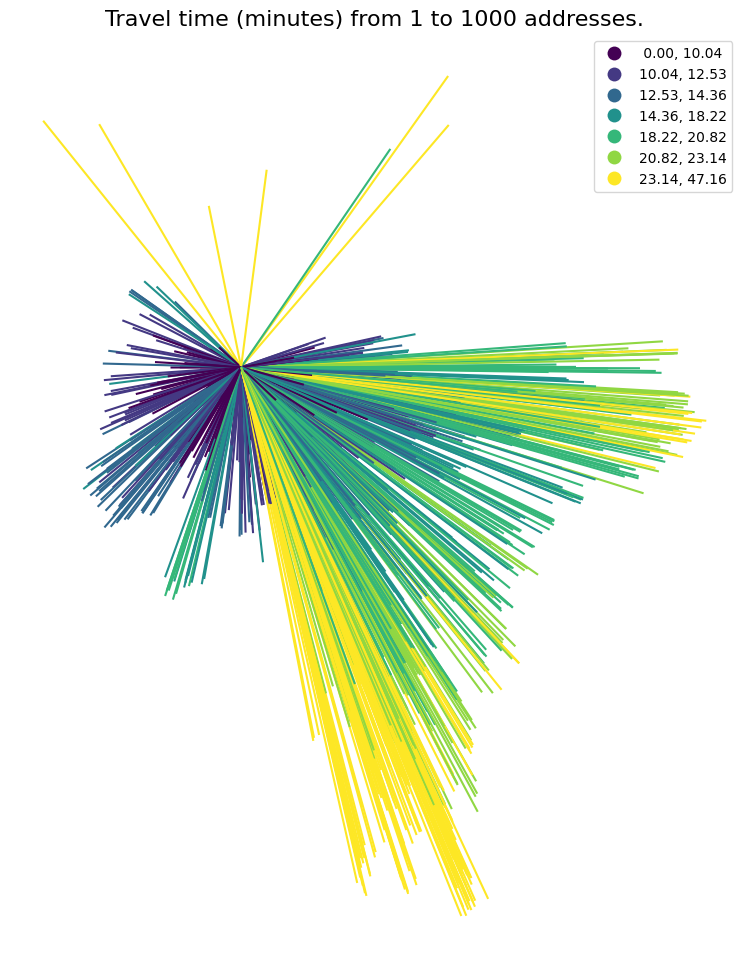
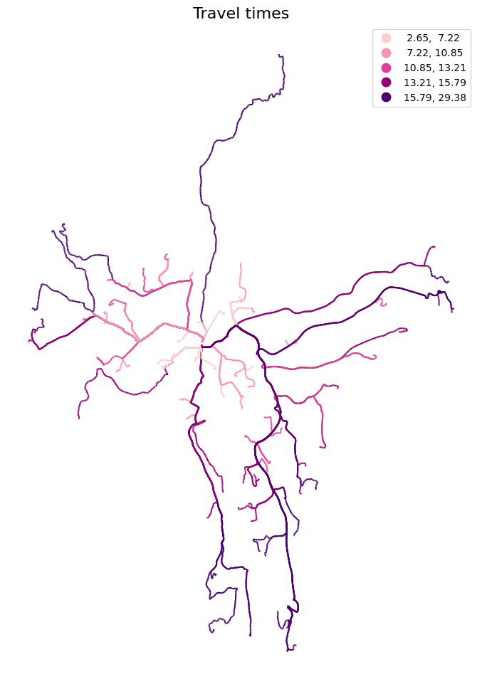
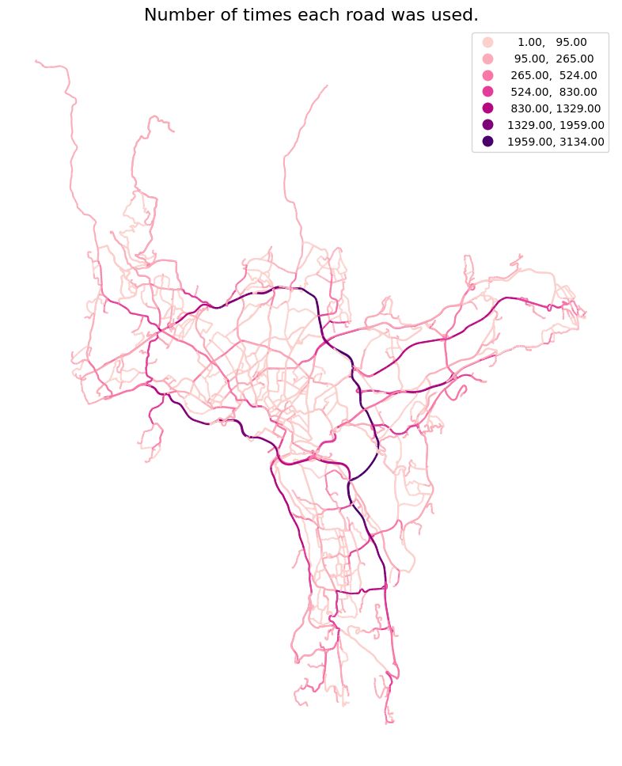
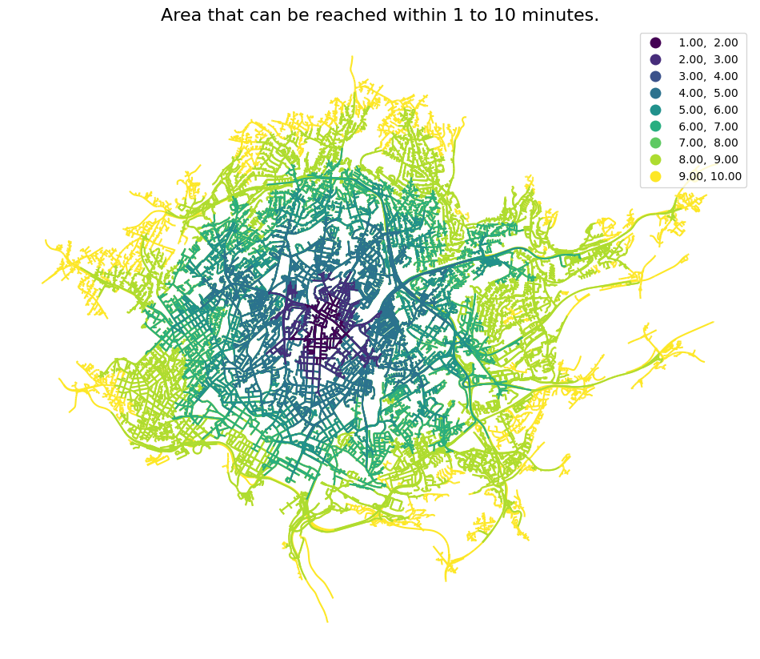
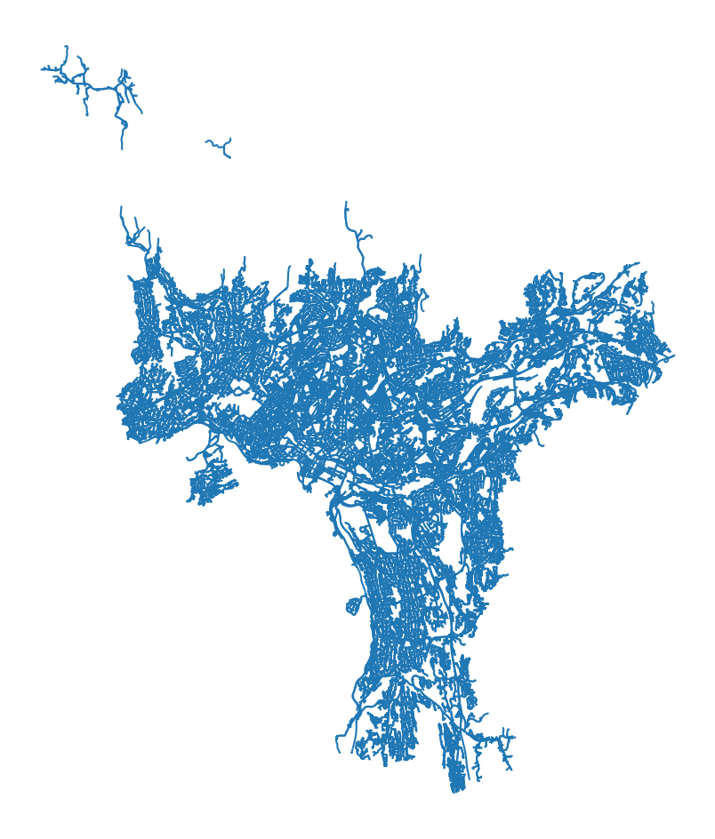
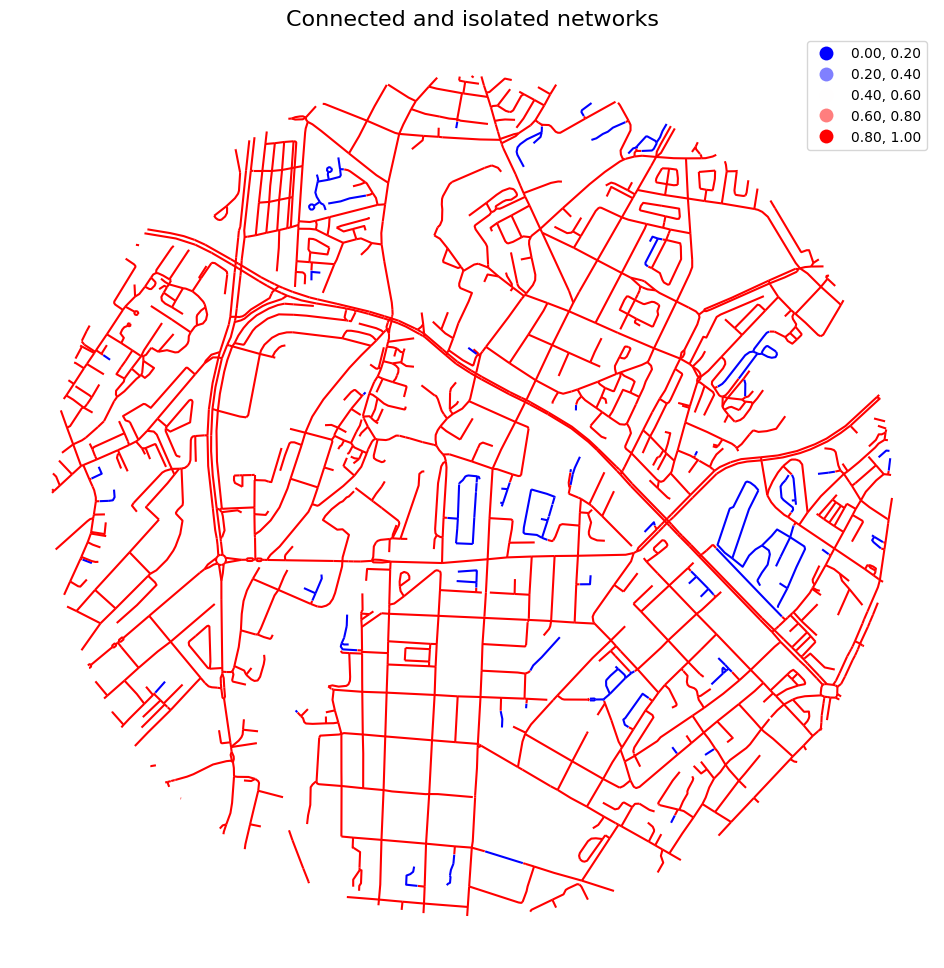
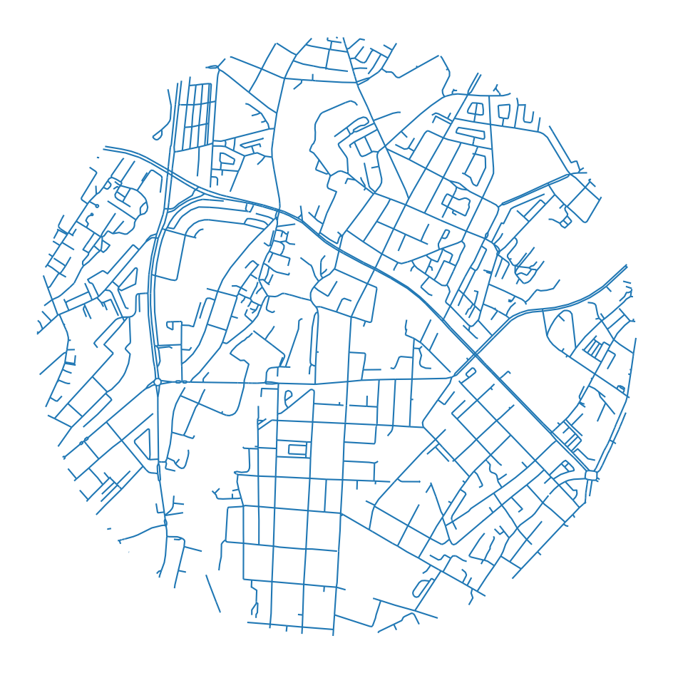

## Network analysis with ssb-gis-utils

Network analysis with igraph, integrated with geopandas.

The package supports three types of network analysis:

- od_cost_matrix: fast many-to-many travel times/distances
- shortest_path: returns the geometry of the lowest-cost paths.
- service_area: returns the roads that can be reached within one or more impedances.

```python
import geopandas as gpd
import numpy as np
import pandas as pd
import matplotlib.pyplot as plt

pd.options.mode.chained_assignment = None  # ignore SettingWithCopyWarning for now

import os

os.chdir("../src")

import gis_utils as gs

os.chdir("..")
```

Let's start by loading the data:

```python
points = gpd.read_parquet("tests/testdata/random_points.parquet")
points
```

<div>
<style scoped>
    .dataframe tbody tr th:only-of-type {
        vertical-align: middle;
    }

    .dataframe tbody tr th {
        vertical-align: top;
    }

    .dataframe thead th {
        text-align: right;
    }

</style>
<table border="1" class="dataframe">
  <thead>
    <tr style="text-align: right;">
      <th></th>
      <th>idx</th>
      <th>geometry</th>
    </tr>
  </thead>
  <tbody>
    <tr>
      <th>0</th>
      <td>1</td>
      <td>POINT (263122.700 6651184.900)</td>
    </tr>
    <tr>
      <th>1</th>
      <td>2</td>
      <td>POINT (272456.100 6653369.500)</td>
    </tr>
    <tr>
      <th>2</th>
      <td>3</td>
      <td>POINT (270082.300 6653032.700)</td>
    </tr>
    <tr>
      <th>3</th>
      <td>4</td>
      <td>POINT (259804.800 6650339.700)</td>
    </tr>
    <tr>
      <th>4</th>
      <td>5</td>
      <td>POINT (272876.200 6652889.100)</td>
    </tr>
    <tr>
      <th>...</th>
      <td>...</td>
      <td>...</td>
    </tr>
    <tr>
      <th>995</th>
      <td>996</td>
      <td>POINT (266801.700 6647844.500)</td>
    </tr>
    <tr>
      <th>996</th>
      <td>997</td>
      <td>POINT (261274.000 6653593.400)</td>
    </tr>
    <tr>
      <th>997</th>
      <td>998</td>
      <td>POINT (263542.900 6645427.000)</td>
    </tr>
    <tr>
      <th>998</th>
      <td>999</td>
      <td>POINT (269226.700 6650628.000)</td>
    </tr>
    <tr>
      <th>999</th>
      <td>1000</td>
      <td>POINT (264570.300 6644239.500)</td>
    </tr>
  </tbody>
</table>
<p>1000 rows × 2 columns</p>
</div>

```python
roads = gpd.read_parquet("tests/testdata/roads_oslo_2022.parquet")
roads = roads[["oneway", "drivetime_fw", "drivetime_bw", "geometry"]]
roads.head(3)
```

<div>
<style scoped>
    .dataframe tbody tr th:only-of-type {
        vertical-align: middle;
    }

    .dataframe tbody tr th {
        vertical-align: top;
    }

    .dataframe thead th {
        text-align: right;
    }

</style>
<table border="1" class="dataframe">
  <thead>
    <tr style="text-align: right;">
      <th></th>
      <th>oneway</th>
      <th>drivetime_fw</th>
      <th>drivetime_bw</th>
      <th>geometry</th>
    </tr>
  </thead>
  <tbody>
    <tr>
      <th>119702</th>
      <td>B</td>
      <td>0.216611</td>
      <td>0.216611</td>
      <td>MULTILINESTRING Z ((258028.440 6674249.890 413...</td>
    </tr>
    <tr>
      <th>199710</th>
      <td>FT</td>
      <td>0.099323</td>
      <td>-1.000000</td>
      <td>MULTILINESTRING Z ((271778.700 6653238.900 138...</td>
    </tr>
    <tr>
      <th>199725</th>
      <td>FT</td>
      <td>0.173963</td>
      <td>-1.000000</td>
      <td>MULTILINESTRING Z ((271884.510 6653207.540 142...</td>
    </tr>
  </tbody>
</table>
</div>

## The Network

```python
nw = gs.Network(roads)
nw
```

    Network class instance with 93395 rows and a length of 3851 km.

```python
nw.gdf.head(3)
```

<div>
<style scoped>
    .dataframe tbody tr th:only-of-type {
        vertical-align: middle;
    }

    .dataframe tbody tr th {
        vertical-align: top;
    }

    .dataframe thead th {
        text-align: right;
    }

</style>
<table border="1" class="dataframe">
  <thead>
    <tr style="text-align: right;">
      <th></th>
      <th>oneway</th>
      <th>drivetime_fw</th>
      <th>drivetime_bw</th>
      <th>idx_orig</th>
      <th>source_wkt</th>
      <th>target_wkt</th>
      <th>source</th>
      <th>target</th>
      <th>n_source</th>
      <th>n_target</th>
      <th>geometry</th>
    </tr>
  </thead>
  <tbody>
    <tr>
      <th>0</th>
      <td>B</td>
      <td>0.216611</td>
      <td>0.216611</td>
      <td>119702</td>
      <td>POINT (258028.4400000004 6674249.890000001)</td>
      <td>POINT (258023.5 6674213.59)</td>
      <td>0</td>
      <td>49540</td>
      <td>1</td>
      <td>2</td>
      <td>LINESTRING Z (258028.440 6674249.890 413.751, ...</td>
    </tr>
    <tr>
      <th>1</th>
      <td>FT</td>
      <td>0.099323</td>
      <td>-1.000000</td>
      <td>199710</td>
      <td>POINT (271778.7000000002 6653238.9)</td>
      <td>POINT (271884.5099999998 6653207.539999999)</td>
      <td>1</td>
      <td>2</td>
      <td>2</td>
      <td>4</td>
      <td>LINESTRING Z (271778.700 6653238.900 138.671, ...</td>
    </tr>
    <tr>
      <th>2</th>
      <td>FT</td>
      <td>0.173963</td>
      <td>-1.000000</td>
      <td>199725</td>
      <td>POINT (271884.5099999998 6653207.539999999)</td>
      <td>POINT (272069.7999999998 6653152.5)</td>
      <td>2</td>
      <td>60241</td>
      <td>4</td>
      <td>2</td>
      <td>LINESTRING Z (271884.510 6653207.540 142.211, ...</td>
    </tr>
  </tbody>
</table>
</div>

The network class includes methods for optimizing the road data. More about this further down in this notebook.

```python
nw = (
    nw.close_network_holes(1.5)
    .remove_isolated()
    .cut_lines(100)
)
nw
```

    Network class instance with 132399 rows and a length of 3832 km.

For directed network analysis, the DirectedNetwork class can be used. This inherits all methods from the Network class, and also includes methods for making a directed network.

```python
nw = gs.DirectedNetwork(roads).remove_isolated()
nw
```

    c:\Users\ort\git\ssb-gis-utils\src\gis_utils\directednetwork.py:31: UserWarning:
    Your network does not seem to be directed.
    Try running 'make_directed_network' or 'make_directed_network_osm'.
    With 'make_directed_network', specify the direction column (e.g. 'oneway'),
    and the values of directions 'both', 'from', 'to' in a tuple (e.g. ("B", "F", "T")).

      warnings.warn(


    DirectedNetwork class instance with 85638 rows and 12 columns.

The above warning suggests that the data might not be directed yet. This is correct. The roads going both ways, only appear once, and the roads going backwards, have to be flipped around.

This can be done in the make_directed_network method.

```python
nw2 = nw.copy()
nw2 = nw2.make_directed_network(
    direction_col="oneway",
    direction_vals_bft=("B", "FT", "TF"),
    speed_col=None,
    minute_cols=("drivetime_fw", "drivetime_bw"),
    flat_speed=None,
)
nw2
```

    DirectedNetwork class instance with 160137 rows and 13 columns.

The roads now have almost twice as many rows, since most roads are bidirectional in this network.

OpenStreetMap road data and Norwegian road network can be made directional with custom methods, where the default parameters should give the correct results:

```python
# nw.make_directed_network_osm()
```

```python
nw = nw.make_directed_network_norway()
nw
```

    DirectedNetwork class instance with 160137 rows and 13 columns.

## NetworkAnalysis

The NetworkAnalysis class takes a network and some rules.

This will set the rules to its default values:

```python
rules = gs.NetworkAnalysisRules(cost="minutes")
rules
```

    NetworkAnalysisRules(cost=minutes, search_tolerance=250, search_factor=10, cost_to_nodes=5)

Now we have what we need to start the network analysis.

```python
nwa = gs.NetworkAnalysis(
    network=nw,
    rules=rules
)
nwa
```

    NetworkAnalysis(cost=minutes, search_tolerance=250, search_factor=10, cost_to_nodes=5)

od_cost_matrix calculates the traveltime from a set of startpoints to a set of endpoints:

```python
od = nwa.od_cost_matrix(points, points, id_col="idx")
od
```

<div>
<style scoped>
    .dataframe tbody tr th:only-of-type {
        vertical-align: middle;
    }

    .dataframe tbody tr th {
        vertical-align: top;
    }

    .dataframe thead th {
        text-align: right;
    }

</style>
<table border="1" class="dataframe">
  <thead>
    <tr style="text-align: right;">
      <th></th>
      <th>origin</th>
      <th>destination</th>
      <th>minutes</th>
    </tr>
  </thead>
  <tbody>
    <tr>
      <th>0</th>
      <td>1</td>
      <td>1</td>
      <td>0.000000</td>
    </tr>
    <tr>
      <th>1</th>
      <td>1</td>
      <td>2</td>
      <td>14.163117</td>
    </tr>
    <tr>
      <th>2</th>
      <td>1</td>
      <td>3</td>
      <td>11.855891</td>
    </tr>
    <tr>
      <th>3</th>
      <td>1</td>
      <td>4</td>
      <td>9.260018</td>
    </tr>
    <tr>
      <th>4</th>
      <td>1</td>
      <td>5</td>
      <td>15.655043</td>
    </tr>
    <tr>
      <th>...</th>
      <td>...</td>
      <td>...</td>
      <td>...</td>
    </tr>
    <tr>
      <th>999995</th>
      <td>1000</td>
      <td>996</td>
      <td>11.372221</td>
    </tr>
    <tr>
      <th>999996</th>
      <td>1000</td>
      <td>997</td>
      <td>18.345221</td>
    </tr>
    <tr>
      <th>999997</th>
      <td>1000</td>
      <td>998</td>
      <td>10.666018</td>
    </tr>
    <tr>
      <th>999998</th>
      <td>1000</td>
      <td>999</td>
      <td>15.173808</td>
    </tr>
    <tr>
      <th>999999</th>
      <td>1000</td>
      <td>1000</td>
      <td>0.000000</td>
    </tr>
  </tbody>
</table>
<p>1000000 rows × 3 columns</p>
</div>

Set 'lines' to True to get straight lines between origin and destination:

```python
od = nwa.od_cost_matrix(points.sample(1), points, lines=True)

gs.qtm(
    od,
    "minutes",
    title="Travel time (minutes) from 1 to 1000 addresses.",
    k=7,
)
```



The shortest_path method can be used to get the actual paths:

```python
sp = nwa.shortest_path(points.iloc[[0]], points.sample(100), id_col="idx")

gs.qtm(sp, "minutes", cmap=gs.chop_cmap("RdPu", 0.2), title="Travel times")

sp
```

<div>
<style scoped>
    .dataframe tbody tr th:only-of-type {
        vertical-align: middle;
    }

    .dataframe tbody tr th {
        vertical-align: top;
    }

    .dataframe thead th {
        text-align: right;
    }

</style>
<table border="1" class="dataframe">
  <thead>
    <tr style="text-align: right;">
      <th></th>
      <th>origin</th>
      <th>destination</th>
      <th>minutes</th>
      <th>geometry</th>
    </tr>
  </thead>
  <tbody>
    <tr>
      <th>0</th>
      <td>1</td>
      <td>155</td>
      <td>25.173575</td>
      <td>MULTILINESTRING Z ((263657.065 6639633.600 95....</td>
    </tr>
    <tr>
      <th>1</th>
      <td>1</td>
      <td>94</td>
      <td>22.320564</td>
      <td>MULTILINESTRING Z ((266999.100 6640759.200 133...</td>
    </tr>
    <tr>
      <th>2</th>
      <td>1</td>
      <td>529</td>
      <td>11.734803</td>
      <td>MULTILINESTRING Z ((265035.261 6646071.360 167...</td>
    </tr>
    <tr>
      <th>3</th>
      <td>1</td>
      <td>971</td>
      <td>11.081780</td>
      <td>MULTILINESTRING Z ((262623.190 6652506.640 79....</td>
    </tr>
    <tr>
      <th>4</th>
      <td>1</td>
      <td>112</td>
      <td>11.414343</td>
      <td>MULTILINESTRING Z ((265808.097 6646476.613 122...</td>
    </tr>
    <tr>
      <th>...</th>
      <td>...</td>
      <td>...</td>
      <td>...</td>
      <td>...</td>
    </tr>
    <tr>
      <th>95</th>
      <td>1</td>
      <td>800</td>
      <td>4.090858</td>
      <td>MULTILINESTRING Z ((263653.383 6650170.636 27....</td>
    </tr>
    <tr>
      <th>96</th>
      <td>1</td>
      <td>484</td>
      <td>3.513541</td>
      <td>MULTILINESTRING Z ((262863.700 6650489.600 19....</td>
    </tr>
    <tr>
      <th>97</th>
      <td>1</td>
      <td>404</td>
      <td>17.001788</td>
      <td>MULTILINESTRING Z ((272281.367 6653079.745 160...</td>
    </tr>
    <tr>
      <th>98</th>
      <td>1</td>
      <td>398</td>
      <td>9.689767</td>
      <td>MULTILINESTRING Z ((258781.100 6652368.597 70....</td>
    </tr>
    <tr>
      <th>99</th>
      <td>1</td>
      <td>776</td>
      <td>10.366584</td>
      <td>MULTILINESTRING Z ((259299.882 6652137.025 58....</td>
    </tr>
  </tbody>
</table>
<p>100 rows × 4 columns</p>
</div>



Set 'summarise' to True to get the number of times each road segment was used. This is faster than not summarising, because no dissolve is done.

```python
sp = nwa.shortest_path(points.sample(150), points.sample(150), summarise=True)

gs.qtm(
    sp,
    "n",
    scheme="naturalbreaks",
    k=7,
    cmap=gs.chop_cmap("RdPu", 0.2),
    title="Number of times each road was used.",
)
```



The service_area method finds the area that can be reached within one or more impedances.

Here, we find the areas that can be reached within 5, 10 and 15 minutes for five random points:

```python
sa = nwa.service_area(points.sample(5), impedance=(5, 10, 15), id_col="idx")
sa
```

<div>
<style scoped>
    .dataframe tbody tr th:only-of-type {
        vertical-align: middle;
    }

    .dataframe tbody tr th {
        vertical-align: top;
    }

    .dataframe thead th {
        text-align: right;
    }

</style>
<table border="1" class="dataframe">
  <thead>
    <tr style="text-align: right;">
      <th></th>
      <th>minutes</th>
      <th>idx</th>
      <th>geometry</th>
    </tr>
  </thead>
  <tbody>
    <tr>
      <th>0</th>
      <td>5</td>
      <td>502</td>
      <td>MULTILINESTRING Z ((256284.280 6651413.280 84....</td>
    </tr>
    <tr>
      <th>1</th>
      <td>10</td>
      <td>502</td>
      <td>MULTILINESTRING Z ((257935.700 6651969.000 80....</td>
    </tr>
    <tr>
      <th>2</th>
      <td>15</td>
      <td>502</td>
      <td>MULTILINESTRING Z ((264348.673 6648271.134 17....</td>
    </tr>
    <tr>
      <th>3</th>
      <td>5</td>
      <td>416</td>
      <td>MULTILINESTRING Z ((258018.154 6650524.353 16....</td>
    </tr>
    <tr>
      <th>4</th>
      <td>10</td>
      <td>416</td>
      <td>MULTILINESTRING Z ((262670.900 6647824.940 2.2...</td>
    </tr>
    <tr>
      <th>5</th>
      <td>15</td>
      <td>416</td>
      <td>MULTILINESTRING Z ((264348.673 6648271.134 17....</td>
    </tr>
    <tr>
      <th>6</th>
      <td>5</td>
      <td>746</td>
      <td>MULTILINESTRING Z ((264348.673 6648271.134 17....</td>
    </tr>
    <tr>
      <th>7</th>
      <td>10</td>
      <td>746</td>
      <td>MULTILINESTRING Z ((264348.673 6648271.134 17....</td>
    </tr>
    <tr>
      <th>8</th>
      <td>15</td>
      <td>746</td>
      <td>MULTILINESTRING Z ((266382.600 6639604.600 -99...</td>
    </tr>
    <tr>
      <th>9</th>
      <td>5</td>
      <td>500</td>
      <td>MULTILINESTRING Z ((266909.769 6651075.250 114...</td>
    </tr>
    <tr>
      <th>10</th>
      <td>10</td>
      <td>500</td>
      <td>MULTILINESTRING Z ((264348.673 6648271.134 17....</td>
    </tr>
    <tr>
      <th>11</th>
      <td>15</td>
      <td>500</td>
      <td>MULTILINESTRING Z ((264348.673 6648271.134 17....</td>
    </tr>
  </tbody>
</table>
</div>

```python
sa = (
    nwa.service_area(points.iloc[[0]], impedance=np.arange(1, 11))
    .sort_values("minutes", ascending=False)
)
gs.qtm(sa, "minutes", k=9, title="Area that can be reached within 1 to 10 minutes.")
```



Set 'dissolve' to False to get every road segment returned, one for each service area that uses the segment. If there are a lot of overlapping service areas, that are to be dissolved in the end, removing duplicates first will make things a whole lot faster.

```python
sa = nwa.service_area(points.sample(250), impedance=5, dissolve=False)

print(len(sa))

sa = sa.drop_duplicates(["source", "target"])

print(len(sa))

gs.qtm(sa)
```

    1445557
    151225



### Customising the network

```python
nw = gs.DirectedNetwork(roads)
nw
```

    c:\Users\ort\git\ssb-gis-utils\src\gis_utils\directednetwork.py:31: UserWarning:
    Your network does not seem to be directed.
    Try running 'make_directed_network' or 'make_directed_network_osm'.
    With 'make_directed_network', specify the direction column (e.g. 'oneway'),
    and the values of directions 'both', 'from', 'to' in a tuple (e.g. ("B", "F", "T")).

      warnings.warn(


    DirectedNetwork class instance with 93395 rows and 11 columns.

Networks often consist of one large, connected network and many small, isolated "network islands".

Start- and endpoints located inside these isolated networks, will have a hard time finding their way out.

The large, connected network component can be found with the method get_largest_component:

```python
nw = nw.get_largest_component()

gs.clipmap(
    nw.gdf,
    points.iloc[[0]].buffer(1000),
    column="connected",
    title="Connected and isolated networks",
    scheme="equalinterval",
    cmap="bwr",
    explore=False,
)
```



Use the remove_isolated method to remove the unconnected roads:

```python
nw = nw.remove_isolated()

gs.clipmap(
    nw.gdf,
    points.iloc[[0]].buffer(1000),
    explore=False,
)

nw
```

    DirectedNetwork class instance with 85638 rows and 12 columns.



If your road data has small gaps between the segments, these can be populated with straight lines:

```python
nw = nw.close_network_holes(max_dist=1.5)  # meters
nw
```

    DirectedNetwork class instance with 86929 rows and 13 columns.

The network analysis is done from node to node. In a service area analysis, the results will be inaccurate for long lines, since the endpoint will either be reached or not within the impedance. This can be fixed by cutting all lines to a maximum distance.

Note: cutting the lines can be time consuming for large networks and low maximum distances.

```python
nw = nw.cut_lines(25)  # meters
nw
```

    DirectedNetwork class instance with 399231 rows and 13 columns.

```python

```
