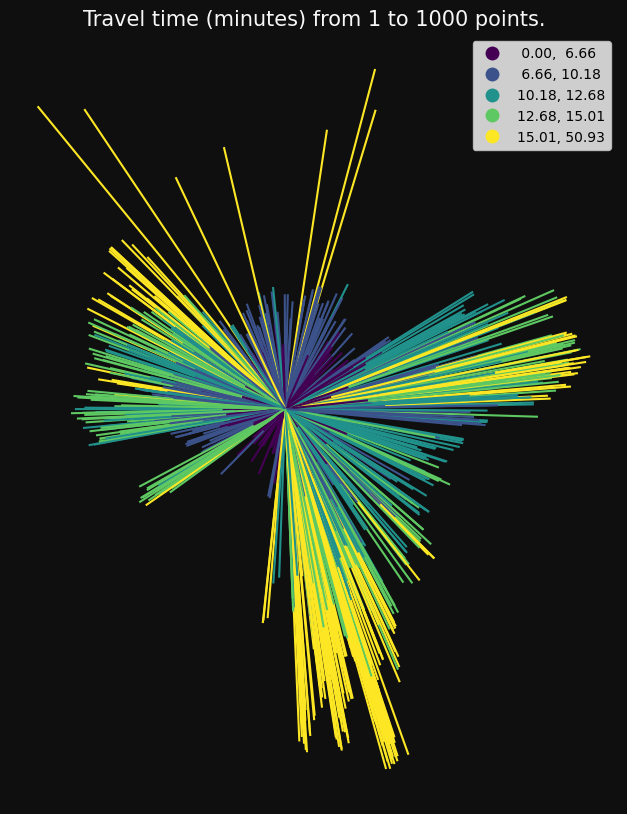
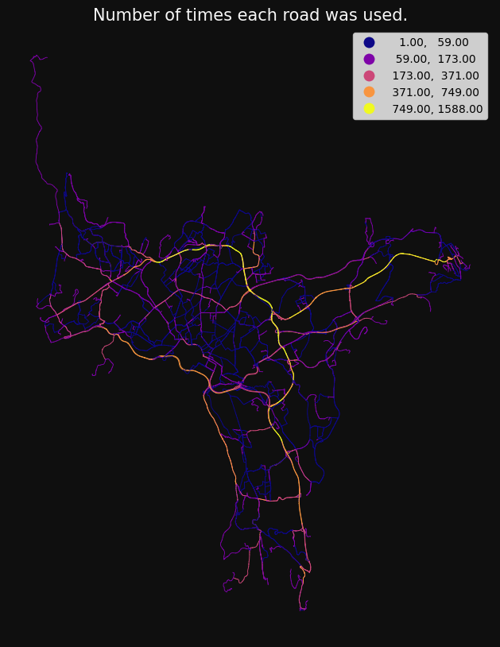

## Network analysis

The package supports three types of network analysis, and methods for customising and optimising your road data.

Analysis can start by initialising a NetworkAnalysis instance:

```python
from gis_utils import DirectedNetwork, NetworkAnalysisRules, NetworkAnalysis

roads = gpd.read_parquet("tests/testdata/roads_oslo_2022.parquet")

nw = (
    DirectedNetwork(roads)
    .remove_isolated()
    .make_directed_network(
        direction_col="oneway",
        direction_vals_bft=("B", "FT", "TF"),
        minute_cols=("drivetime_fw", "drivetime_bw"),
        )
)

rules = NetworkAnalysisRules(weight="minutes")

nwa = NetworkAnalysis(
    network=nw, rules=rules
)

nwa
```

    NetworkAnalysis(network=DirectedNetwork(6364 km), rules=NetworkAnalysisRules(weight='minutes', search_tolerance=250, search_factor=10, ...))

```python
points = gpd.read_parquet("tests/testdata/random_points.parquet")
p1 = points.iloc[[0]]
```

### OD cost matrix

Fast many-to-many travel times/distances

```python
od = nwa.od_cost_matrix(p1, points, lines=True)

print(od.head(3))

gs.qtm(od, "minutes", title="Travel time (minutes) from 1 to 1000 points.", **plot_kwargs,
)
```

      origin destination    minutes  \
    0  79166       79167   0.000000
    1  79166       79168  12.930588
    2  79166       79169  10.867076

                                                geometry
    0  LINESTRING (263122.700 6651184.900, 263122.700...
    1  LINESTRING (263122.700 6651184.900, 272456.100...
    2  LINESTRING (263122.700 6651184.900, 270082.300...



### Shortest path

Get the actual paths, either individually or summarised:

```python
sp = nwa.shortest_path(points.sample(100), points.sample(100), summarise=True)

gs.qtm(
    gs.buff(sp, 15),
    "n",
    scheme="naturalbreaks",
    cmap="plasma",
    title="Number of times each road was used.",
    **plot_kwargs,
)
```



### Service area

Get the area that can be reached within one or more breaks

```python
sa = nwa.service_area(p1, breaks=np.arange(1, 11), dissolve=False)

sa = sa.drop_duplicates(["source", "target"])

gs.qtm(sa, "minutes", k=10, title="Roads that can be reached within 1 to 10 minutes", legend=False, **plot_kwargs)
```


